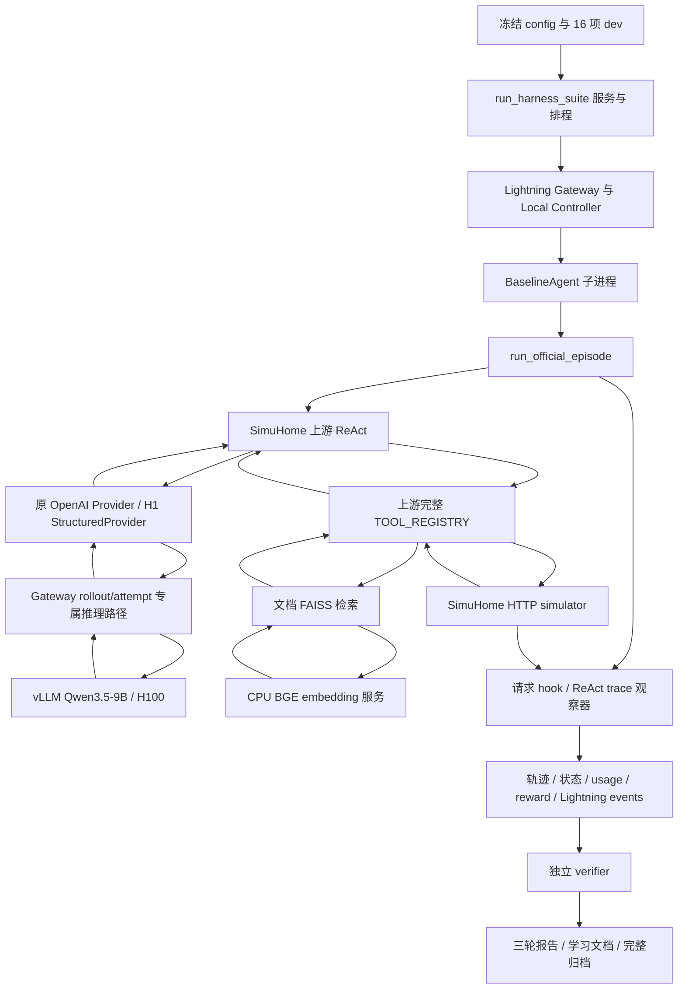

# 当前项目状态与架构

更新：2026-10-03（Asia/Shanghai）。状态：**开发暂停，等待 review**。

这是基于当前文件与证据的检查结果，不是沿用旧报告的进度摘要。相关计划见 [PLAN.md](PLAN.md)，设计选择见 [DECISIONS.md](DECISIONS.md)。本轮只新增三份控制文档，未修改代码、配置、既有报告、实验材料或服务器状态。

## 1. 检查范围与当前源码位置

| 位置 | 角色 | 使用边界 |
|---|---|---|
| `C:\Coding\smartHome` | 本机工作区 | 不是 Git 仓库；包含多代材料及本次三个文档 |
| `outputs/p1-20261003/source-p1/` | 当前 P1 源码快照 | 当前理解代码的入口；包含 99 个源码/配置/测试文件；没有完整 deps、venv 或根 pyproject |
| `outputs/p1-20261003/` | 当前结果与交付 | 报告、学习文档、源码快照、错误证据、归档、校验 |
| `.work/p1-20261003/final-evidence/` | 最终包展开副本 | 有原始 runs；本机 verifier 已改写三个核验文件的换行，详见问题 I-02 |
| `outputs/agent-learning-20261003/source-b0-run03/` | P0 源码参考 | 用于本次比较 P1 新增/修改文件，不作为当前执行入口 |
| `.work/p1-20261003/` | 本机实现与传输暂存 | 包含不同阶段的脚本、包和 evidence，不应任意选副本继续编辑 |
| `referenced-chatgpt-conversation-this-is-an-2/` | 更早交接材料 | 历史来源，不是当前运行结果的权威入口 |
| `upload-to-h100/` | 备用上传暂存 | 当前主要是 P0 下载续传工具；不包含权重或完整工程 |

服务器执行工程：

```text
/HOME/nsccgz_ywang/nsccgz_ywang_wzh/HDD_POOL/zhengrj/agent/smarthome_agent_rl
```

其规范路径位于 `/XYAIFS00/HDD_POOL/.../zhengrj/agent/smarthome_agent_rl`。该项目根也不是 Git 仓库；`deps/SimuHome` 和父目录的 `agent-lightning` 是独立 Git 仓库。

本轮只读检查包括：工作区目录盘点、当前 99 个文件与服务器 SHA256 比较、55 个 Python 文件 AST 解析、关键执行/检索/统计/核验源码阅读、P0/P1 材料检查、最终归档完整性和 96 个 episode 的状态/reward/排程复算。99 个文件全部与服务器一致；55 个 Python 文件全部可解析。AST 可解析不等同于功能测试通过。

本轮未重跑 GPU 实验、单元测试、模型下载或环境安装；下面的运行验证明确区分历史证据与本次只读复算。

## 2. 整体架构与数据流

当前系统是一个实验平台：模型选择动作，SimuHome 执行虚拟设备操作，外部观察器记录真实状态并评分，Lightning 调度和记录 rollout。当前没有训练器参与，没有连接真实家居设备。



### 单个正式 episode

1. Runner 读取配置与冻结任务，保存实际排程、源码、依赖、服务启动与模型环境审计。每轮重新启动服务，轮内顺序执行。
2. Runner 创建 `is_train=false` rollout，把 task/config/output 映射为 worker 环境变量。Local Controller 创建 attempt 并提供专属推理与事件地址。
3. `BaselineAgent` 用 `.venv-baseline` 启动 `run_official_episode.py`。该入口 reset 全局模拟器，并保存初始状态。
4. 真正决策循环是 SimuHome 的 `src.agents.strategies.react_agent.ReActAgent`。B0 使用原表示与原 provider；H1 包装 provider，使用对象 call/schema，然后转换回原 ReAct 动作格式。
5. Gateway 在 val 路径覆盖 model/temperature 并加 token IDs 标记；当前明确配置 temperature=0.7。vLLM 返回文本、usage 与 token IDs，Gateway 记录实际后端请求。
6. 原工具直接调用 simulator。`get_cluster_doc` 则使用注入的匹配 FAISS 数据库；查询向量由独立 CPU 服务生成，工具输出仍为原格式。
7. HTTP hook 与 ReAct trace 记录每次模型调用、动作、反馈及 `/home/state`。观察器计算 reward，不把目标检查或 reward 作为新增反馈送回模型。
8. finish、预算耗尽或连续拒绝后保存最终状态、summary，并向 Lightning 交付 reward。合法任务失败可作为 rollout 数据完成；基础设施/事件交付失败使 runner 停止。
9. verifier 从保存的初始/最终状态、轨迹、请求和 Lightning 事件复算，核对成功、预算、usage、reward 与汇总。

`SimuHomeAdapter` 在当前链路中主要负责 reset 和状态读取；实际动作执行由上游工具负责。它的 `step()` 与项目自写 `react.py` 属于较早 custom-agent 路线，其达到目标即终止的逻辑不能当作当前 B0 的 finish 协议。

### 成功与 reward 的含义

- `goal_success`：最终状态中所有列出的目标谓词满足。
- 严格 `success`：目标满足、显式合法 finish、执行正常完成。
- Lightning `succeeded`：worker 和事件交付完成；不能等同于设备目标成功。
- Goal verifier 只核对 task 中列出的目标，不证明自然语言指令的一切隐含约束或现实设备行为。

当前 reward 为：成功奖励 1.0 + 已满足目标比例的有符号变化 × 0.2 − 非法动作 × 0.1 − 模型步骤 × 0.01 − 生成 tokens/1000 × 0.001。生成成本包含查询、非法动作和 finish；检索 embedding tokens 单列，未计入原生成 reward。

### 固定请求诊断与正式 episode 的区别

固定请求重放冻结 P0 四任务族各首任务的完整首请求，只有生成，没有设备操作、环境循环或任务 reward。72 次诊断覆盖首次正序、同服务反序、重启后正序，每请求每路径三次，两条路径先后交替。完整链路诊断则 reset 并执行工具，下一轮模型输入随真实反馈变化。正式 96 个 episode 全部经过 Lightning；诊断与正式统计分开。

## 3. 当前运行配置与依赖边界

| 项目 | 当前已验证配置 |
|---|---|
| 模型 | `Qwen/Qwen3.5-9B`，revision `c202236235762e1c871ad0ccb60c8ee5ba337b9a`，纯文本、language-model-only |
| 推理 | 既有 `qwen36-vllm` Conda，Python 3.12.13、torch 2.10.0+cu128、vLLM 0.19.0；模型子进程 CUDA 12.8 覆盖 |
| 调度 | Agent Lightning v1.0.2，既有 Conda/Python 3.12.12；未改变用户已有修改 |
| Agent / simulator | 各自 Python 3.13.14 独立 venv |
| Embedding | BGE-small-en-v1.5，revision `5c38ec7c405ec4b44b94cc5a9bb96e735b38267a`；CPU、384 维、独立 embedding venv |
| 生成参数 | seed=42，engine seed=0，temperature=.7，top_p=.8，top_k=20，presence_penalty=1.5，min_p=0，repetition_penalty=1，thinking=false |
| 预算 | 20 次模型调用/episode、2048 输出 tokens/请求、32768 上下文；TP=1、max-num-seqs=1、显存比例 .6 |
| 任务 | 16 项 dev：multiroom/group/dimmer/fan 各四项；实际初始化启用 aggregators 与标准 room.state |
| 服务 | simulator `20080`、vLLM `20000`、Gateway `20181`、CPU embedding `20200`，均为本机 loopback |

SimuHome 固定提交 `83d28837b69f0cbf1bc02ed5334cb8b561a9d54d`；Lightning 当前提交 `d381995396274039f2bb1cbe5ff42ac8067f4e47`。本轮只读检查 SimuHome 工作树为空；Lightning 保留五个用户修改文件（43 行新增、7 行删除）和未跟踪 `tests/server/test_http_limits.py`。这些不能归为 agent 新增修改。

当前执行入口是 `scripts/run-p1-h100.sh` + `configs/p1-qwen35-9b-retrieval.json` + `configs/p1-dev-frozen.json`。这是服务器工程中的入口，当前暂停状态下不执行。

## 4. 已完成工作与真实结果

先完成了 simulator/adapter/verifier、原 ReAct/Lightning 集成和较小模型工程试跑；随后固定 9B 下载清单，校验并加载模型，处理模型进程继承 CUDA 13 的兼容问题，完成 P0。P1 再增加请求冻结、稳定性与链路诊断、三轮排程、跨轮统计及独立检索修复。

### P1 每轮结果

下列数值在三轮完全一致；延迟为三轮均值，随运行时间变化。

| 指标 | B0 upstream-react | H1 structured-schema |
|---|---:|---:|
| 严格成功 / goal_success | 12/16 / 12/16 | 12/16 / 12/16 |
| 模型调用 | 116 | 118 |
| 工具调用 | 100 | 102 |
| 非法动作 | 20 | 24 |
| Prompt tokens | 609291 | 641411 |
| Completion tokens | 14963 | 15327 |
| 总生成 tokens | 624254 | 656738 |
| Episode 秒（三轮均值，总和/轮） | 371.58 | 387.07 |
| Reward 总和 | 10.082413 | 9.696595 |

H1 无成功率提升，非法动作高 20%，总生成 tokens 高 5.20%，调用高 1.72%；episode 时间约高 4.17%，但顺序与环境时间变化使延迟差不能独立归因。两组四项 dimmer 均失败，其他三任务族均 4/4；没有逐任务成功结果翻转。

成功任务子集每轮 B0/H1 调用为 79/78、非法动作均为 1、总生成 tokens 为 399517/399322。因此总体成本增加主要发生在失败任务，不能把总差解释成所有任务一律更贵。

错误证据为跨三轮事件计数：B0/H1 外层参数 12/0、设备命令语义 24/51、只读属性 21/18、未确定 3/3；恢复和提前结束事件另列，可与非法动作类别重叠，不是独立失败任务数。H1 约束外层表示有效，但主要设备语义仍需模型理解。

72 次请求中每个任务/路径九次输出只有一种全文、动作和 token IDs；36 对 direct/Gateway 全部一致。检索修复后的八个完整链路诊断两条路径各成功 3/4，无动作或工具反馈分叉。该结果证明本次配置下的观察一致性，不保证任意参数、多后端或新任务都稳定。

原 `get_cluster_doc` 和 Ada/1536 维 FAISS 索引来自 SimuHome 初始提交，之前没有可用 embedding 后端；不能说是用户实现的检索服务。本阶段新建 CPU BGE 后端，重建同一 70 份文档、1000/200 切分的独立 4130-chunk 索引，保留原索引。官方六文件哈希、三项真实工具检索及实际正式调用成功。

## 5. 关键文件及职责

下表路径相对于当前 [source-p1](outputs/p1-20261003/source-p1/)。按验收 P0 快照比较：**26 个新增、4 个修改、69 个未变**；这是快照差异，不是 Git commit 或逐行作者归属证明。

| 文件/组 | P1 相对 P0 | 职责 |
|---|---|---|
| `smarthome_agent_rl/baseline.py` | 未变 | 当前 Lightning worker，独立子进程运行上游 ReAct，允许合法失败作为数据 |
| `official.py` | 未变 | 旧 worker，执行异常仍失败；不是当前正式 worker |
| `adapter.py`、`reward.py` | 未变 | 模拟器 HTTP、reset、状态谓词与 reward；custom 路线另用 adapter.step |
| `generation.py` | 未变 | 校验并安装固定采样参数到原 SDK 调用，不更换原决策循环 |
| `accounting.py` | 未变 | 观察器补记第三次拒绝，不增加模型反馈、不混淆 transport 错误 |
| `structured.py` | 未变 | 已有外部 schema provider、工具 docstring schema、历史表示转换及可选 guard/recovery/guidance；P1 仅选已有 structured-schema |
| `react.py`、`tasks.py` | 未变 | 较早 custom agent 与简单 dev 任务；不是 P1 的上游 ReAct/16-task 入口 |
| `p1.py` | 新增 | 请求冻结/哈希、动作规范化、实际排程、三轮配对统计 |
| `p1_replay.py` | 新增 | Lightning 固定请求 worker，只生成、不执行工具 |
| `retrieval.py` | 新增 | CPU embedding HTTP client、分开记录检索成本、索引校验与 FAISS 注入 |
| `scripts/run_official_episode.py` | 修改 | 原 ReAct 生命周期、参数/请求观察、工具数据库注入、每步记录与结算；新增计时及诊断 token-ID 支持 |
| `scripts/run_harness_suite.py` | 修改 | 服务创建/释放、配置审计、两组 rollout、顺序参数、诊断分支、CPU 服务与整轮基础设施 fail-stop |
| `scripts/run-single-h100.sh` | 修改 | 单 H100 激活与默认 9B B0 参数；P1 wrapper 再明确覆盖为检索修复配置与两组 |
| `scripts/verify_harness_suite.py` | 修改 | 原独立核验增加排程、诊断隔离/正式目的与 P1 零基础设施故障检查 |
| `scripts/p1_diagnostics.py`、`verify_p1_diagnostics.py` | 新增 | 72 次固定重放、链路运行及独立输入/输出/状态/事件/reward 核验 |
| `scripts/run_p1.py`、`run-p1-h100.sh` | 新增 | 固定三轮编排、每轮 verifier 与报告；手动单轮包装入口 |
| `scripts/download_p1_embedding.py` | 新增 | 固定 BGE revision 下载及官方逐文件哈希 |
| `scripts/isolate_embedding_dependency.py` | 新增 | 将既有兼容 hub 包复制到单独 embedding venv，保留原 Conda |
| `scripts/serve_doc_embeddings.py` | 新增 | CPU tokenizer/model、query prefix、CLS pooling、归一化、embedding 与 health API |
| `scripts/build_doc_retrieval.py`、`prepare_doc_backend.py` | 新增 | 原文档加载/切分、FAISS 构建、真实工具 smoke、准备期间拥有并释放 CPU 服务 |
| `scripts/resume_p1_with_retrieval.py` | 新增 | 检索准备检查、生成共享配置、保存旧编排记录、重启完整实验 |
| `scripts/report_p1.py` | 新增 | 三轮协议核对、全部/成功成本、逐任务均值范围翻转、证据分类及中止/诊断开销 |
| `scripts/finalize_p1.py` | 新增 | 更新服务器文档、源码与证据归档、清理审计、checksum；执行时会写状态/材料 |
| `scripts/doc_dependency_audit.py`、`probe_doc_tool.py` | 新增 | 原检索配置来源与实际工具依赖排障 |
| `scripts/publish_p1_blocked.py` | 新增 | 历史中止交付；不能作为当前状态或恢复入口 |
| `scripts/start_p1.py`、`start_doc_preparation.py`、`start_retrieval_resume.py` | 新增 | 当次后台启动与日志/PID 记录；不是通用幂等恢复器 |
| `configs/p1-qwen35-9b.json`、`p1-qwen35-9b-retrieval.json`、`p1-dev-frozen.json` | 新增 | 继承 P0 协议、共享检索修复、冻结实际 16 项任务 |
| `tests/test_p1.py`、`test_retrieval.py` | 新增 | 三项排程/冻结/隔离统计检查，两项原工具注入/索引损坏拒绝检查 |

既有测试还覆盖采样参数传入真实 SDK、拒绝计数、合法任务失败/reward 交付、schema profiles 和资源隔离。旧脚本 `run_official_stack.py` 硬编码 1.5B，`run_stack.py` 使用 custom agent；`run_parallel_dev.py` 是多资源分片机制。这些源码仍在，但不能当作当前 9B P1 的已验收入口。

本机 `.work/p1-20261003/deliver_final.py` 是交付辅助脚本：校验原归档、展开、复制可读材料、再运行本机 verifier。它没有包含在上述服务器 99 个文件中。P0 另有模型 relay/Range 续传工具；它们负责下载，不参与决策或评测。

学习文档、服务器项目简报、方向状态 JSON 和 P1 报告也在上一阶段更新；本轮不再次写入它们。学习原理可见 [学习文档](outputs/p1-20261003/Agent模块设计与Lightning基线学习文档.md)。

## 6. 已验证能力与证据

| 能力 | 证据 | 能证明到哪一步 |
|---|---|---|
| 9B 文件完整与实际加载 | [P0 下载核验](outputs/p0-20261003/download-verification.json)、load-probe、P1 各轮 model_environment_audit | 固定模型与既有 H100 环境可用；不等于干净机器安装验收 |
| 原 ReAct、工具、状态、reward 闭环 | P1 三轮原始 episode + [local_verification](outputs/p1-20261003/local_verification.json) | 96 次真实推理/模拟器执行，任务与事件可追溯 |
| Gateway 保持本次预期输入/输出 | [diagnostics_verification](outputs/p1-20261003/diagnostics_verification.json)、[稳定性报告](outputs/p1-20261003/P1-稳定性报告.md) | 72 次生成与 8 个链路诊断；不能推广到并发/多后端/训练模式 |
| H1 外层输出契约能运行 | schema 请求、harness_events、96 次两组正式结果 | 对象/schema 组合已执行；不能宣称独立 grammar 效果或成功率提升 |
| 真实 CPU 检索 | [模型核验](outputs/p1-20261003/retrieval-model-verification.json)、[索引核验](outputs/p1-20261003/retrieval-index-verification.json)、各轮 retrieval_events | 原工具 200、关键词 smoke、正式 B0/H1 分别每轮 3/1 次成功；未证明总体检索质量 |
| 原 20 项 + 新 5 项检查 | `.work/p1-20261003/final-evidence/work/p1-20261003/retrieval-tests.log`，25 tests / OK | 有历史测试日志；其中部分是假 transport/mocked embedding，不是全部真实链路 |
| 排程、结果与成本核验 | [三轮报告](outputs/p1-20261003/P1-三轮配对报告.md)、[paired_report](outputs/p1-20261003/paired_report.json)、CSV 与每轮 verification | 原 verifier 通过；本轮另外只读复算 96 次状态/reward/排程通过 |
| 证据交付完整性 | [checksum](outputs/p1-20261003/handover_checksum.json)、[manifest](outputs/p1-20261003/evidence_manifest.json) | 本轮原归档 SHA256 与 3280 项清单全部通过；展开副本有三项换行差异 |
| 本轮源码与服务器一致 | 99 个文件逐一 SHA256 比较 | 检查时一致；不能证明没有未跟踪的其他历史/临时文件 |
| 清理与上游保留 | [cleanup_audit](outputs/p1-20261003/cleanup_audit.json)、本轮 SSH 只读状态 | 历史服务清理审计通过；本轮 H100 为 0 MiB、0%，无 GPU compute app，SimuHome pristine |

最终证据包 SHA256：`8c4f801a09e716b3db25499c260817dee8e0b0e50367882f4e9ec76df4d05fc7`。

## 7. 未验证能力

- 正式独立 train/dev/test 上的泛化，以及大规模任务/更多设备类型表现。
- 9B 上新增设备能力反馈、错误反馈、finish guard 或恢复提示的效果；P1 没有运行这些新增对照。
- 不同请求 seed、引擎参数、GPU、vLLM 版本、并发或多后端下的稳定性。
- 多 H100 并行 9B paired 执行；资源隔离有源码和单元检查，当前 P1 只验收一张 H100 顺序执行。
- embedding 检索 precision/recall、错误文档率、长文截断影响、BGE 与原 Ada 的质量差异；三个关键词 smoke 不能替代检索评测。
- 从完整干净机器/新目录自动安装并重放全部协议；当前依赖继承既有环境，部分路径固定。
- 对服务崩溃、事件丢失、重复事件、重试、磁盘写失败、任意 provider 错误的全面故障注入。
- SFT/LoRA trainer、checkpoint、权重更新、RL/GRPO 训练与训练后评价；当前完全没有训练结果。
- 真实家居设备、多模态、在线持续服务或生产部署。

## 8. 已知问题、技术债与不确定点

| ID | 类型与状态 | 发现、影响与证据 |
|---|---|---|
| I-01 | 历史报告错误；已补充纠正，原报告保留 | P0 原报告声称基础设施故障 0/16，原 summary 却有文档检索故障。12/16 设备目标记录保留，但不能当作同环境的有效对照；见 P1 学习文档第 21 节与历史 raw runs |
| I-02 | 本机证据副本被 verifier 重写；本轮未修复 | `verify_harness_suite.py` 会写 run/verification.json。交付脚本先核验清单再运行它，Windows 将三轮文件 LF 改成 CRLF。因此当前展开目录 3/3280 字节哈希不匹配；JSON 内容完全相同。原归档 3280/3280 全通过，成绩无变化。后续应让核验输出另存，不写原证据 |
| I-03 | 文档进度不一致；本轮未修复旧文档 | 旧服务器简报仍有“重复稳定性、9B harness 对照尚未开展”等句子，顶部虽有 P1 完成通知，正文易误读。本次三份文档按原始材料纠正当前状态 |
| I-04 | 工程版本管理缺口 | 本机及服务器项目根无 `.git`；多代 source/work/outputs 副本并存。只能做快照比较，不能声称有完整项目 commit 历史。当前源码一致，未来仍需要明确编辑/发布基点 |
| I-05 | 恢复与重放脚本固定当次目录 | `run_p1.py` 使用固定日期与 run-02，`mkdir(exist_ok=False)`。再次运行会与旧链路/轮目录冲突；不能直接当作“继续 P1”的恢复命令。部分 start 脚本会覆盖当次日志/PID |
| I-06 | 环境重建/打包不完整 | 根 pyproject 只声明 httpx/openai；SimuHome、FAISS/langchain、torch/transformers、Lightning 分布在多环境。embedding venv 借用 system-site-packages 并复制 hub0.36.2；包中未带该 venv。现有环境已运行，迁移能力未验收 |
| I-07 | 历史入口与默认参数容易误用 | `run_official_stack.py` 硬编码 1.5B；custom `react.py` 的工具/终止逻辑不同。只存在脚本不代表符合当前 9B 协议，切勿混合其成绩 |
| I-08 | 耦合到上游和 SDK 私有结构 | `_client._client.event_hooks`、SDK create 包装、上游 trace/error 文本、docstring 正则和实际任务标记。固定版本已验证，上游升级可能破坏观测/schema/失败识别 |
| I-09 | 运行校验依赖 assert | 多处协议、hash、CPU dimension、独立 verifier 使用 assert。若用 `python -O`，检查会被移除。当前运行未用该模式，未来应明确运行要求或改为显式异常 |
| I-10 | 故障计数不覆盖一切顶层异常 | `infrastructure_errors` 主要统计已经进入 trajectory 的工具反馈。模型 transport、reset 或事件交付异常还需结合 `error`、worker 状态和日志；不能仅凭该计数为零判健康 |
| I-11 | 结算/发布不是事务 | episode finally 依赖模拟器可读，若服务已退出可能无法完整结算；finalizer 在完成部分文档写入后才做全部清理/dirty 状态检查。当前验收成功，但这些失败路径未全面验证 |
| I-12 | 索引与健康审计边界 | FAISS pickle 只用于可信本地索引，加载前检查已有清单；health 证明 CPU/维度，不逐项绑定服务实际权重哈希；启动审计与下载清单共同提供证据。缺损清单/服务被换模型的故障测试不全面 |
| I-13 | 当前模型能力限制 | dimmer 四项持续失败，涉及内部参数名、只读属性和提前结束；6 个非法事件仍未确定具体原因。不得把未确定事件仅凭 HTTP 400 归因 |
| I-14 | 统计与成本解释限制 | 16 项 dev 已参与开发，三轮输出高度重复；固定 seed 与顺序/热状态/重启共同变化。延迟不含下载/模型加载/服务启动，CPU embedding 成本单列，不能当作端到端部署成本 |

I-02 是本轮重新检查发现的真实交付行为问题，不是模型结果损坏。其他源码风险按“已确认限制/未验证失败路径”记录，不把推测写成已发生故障。本轮依照暂停要求没有修复任何上述代码或材料。

## 9. 如何重新掌握项目

先 review 当前 B0、共享检索修复和成功/reward 定义，再 review [DECISIONS](DECISIONS.md) 中 agent 自行选择的实现方式。随后确认一个可编辑工程基点，保持原归档不可变，才进入下一项维护或实验。

建议下一项研究优先考虑设备命令能力反馈，因为直接证据显示外层 schema 减少了该类错误，却没有解决 dimmer 的主要语义问题。实施前需冻结单变量协议；是否先做工程维护、能力反馈或错误反馈由用户 review 后决定。详见 [PLAN](PLAN.md)。

**现在停止：没有新实验、没有下一阶段实现、没有训练，也没有后台自动推进任务。**
