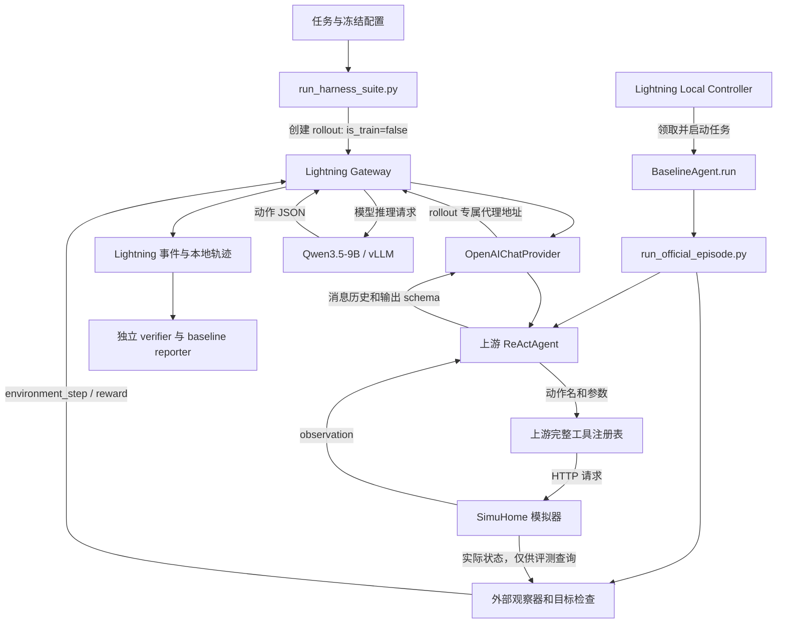

# Agent 模块设计与 Agent Lightning 基线学习文档

更新：2026-10-03。对应模型 Qwen3.5-9B，基线 `B0-ReAct-v1`，已验证运行 `b0-qwen35-9b-20261003-03`。

本文从“输入一条智能家居指令，到模型操作设备，再到判断是否成功”解释真实代码。伪代码用于说明职责和执行顺序，省略了部分异常分支，不能直接代替生产代码。原代码、真实轨迹和独立复核结果与本文一起保存在本机。

## 1. 现在到底在复现什么

当前目标是在已有 Agent Lightning v1.0.2 中运行本项目的 **B0 ReAct 基线**，并证明模型请求、工具执行、环境状态、reward 和评测记录互相对应。决策循环复用固定版本的 SimuHome ReAct；我们编写外部运行、配置、观察和核验代码。

这一步已经完成了一次完整验收：真实 9B 执行 16 项 dev，严格成功 12/16（75%），独立核验通过。四项调光失败是保留下来的 agent 能力问题。全程 `is_train=false`，没有更新模型参数。

这里的“复现”有三个层次，当前进度如下：

| 层次 | 要回答的问题 | 当前证据 |
|---|---|---|
| 集成复现 | 原 ReAct 能否通过 Lightning 调度、推理和记录？ | 已有真实 rollout、Gateway 请求、工具反馈和 reward |
| 配置与结果可核查 | 用了什么模型、任务、采样和预算？成绩能否重算？ | 已保存协议、源码快照、完整轨迹；服务器和本机独立核验通过 |
| 重复运行稳定性 | 相同条件再跑，输出和成功率是否稳定？ | P1 已完成 72 次固定请求、8 个 direct/Lightning 链路诊断和三轮 96 个正式 episode，独立核验通过 |

本项目当前不以复现 SimuHome 论文或官方 benchmark 成绩为目标。P1 已完成稳定性和同模型、同任务、同预算的 harness 对照；接下来根据失败证据决定设备能力或错误反馈对照，再规划正式数据划分、SFT 和 RL。

## 2. 五个概念：LLM、Agent、Harness、环境、Lightning

| 概念 | 在本项目中的含义 | 谁负责 |
|---|---|---|
| LLM / 模型 | 根据输入消息生成文本；当前权重是 Qwen3.5-9B | vLLM 模型服务 |
| Agent | 用模型选择动作，执行工具，读取反馈，决定下一步 | SimuHome `ReActAgent` |
| Harness | 给 agent 提供提示词、输出契约、工具接口、预算和结束规则的执行框架 | B0 使用原 ReAct 契约；改进版使用外部 `StructuredProvider` |
| 环境 | 持有虚拟房间、设备和属性，真正处理命令并改变状态 | SimuHome HTTP simulator |
| Lightning | 创建和调度任务，把模型请求绑定到 rollout，存储事件与 reward | 现有 Local Controller 和 Gateway |

本项目自己的 `run_harness_suite.py` 在最外层启动服务、提交任务、收集产物。它与 agent 内部的 harness 是两个层面的运行逻辑。

**模型只生成动作文本；工具代码才会改变设备状态。** Lightning 管理这次运行，设备是否合法以及结果如何，由工具与环境决定。

## 3. 整体架构：控制、推理、执行、评测分开



关键数据路径是：

1. **控制路径**：runner → Gateway 的 rollout API → Controller → worker。
2. **推理路径**：ReAct → provider → Lightning proxy → vLLM → 原路返回。
3. **执行路径**：ReAct → 原工具函数 → simulator → observation → ReAct 历史。
4. **评测路径**：观察器读取真实状态 → 目标检查和 reward → 保存证据 → 独立重算。

观察器额外读取的完整状态和目标谓词不自动加入模型上下文。模型可以自主调用原有查询工具，例如 `get_home_state`；这种自主查询与评测器私下读取状态是不同的数据来源。

## 4. 模块一：任务、状态与目标

任务同时定义“模型看到的指令”和“评测器使用的目标”，两者用途不同。

```python
task = {
    "schema": "smarthome-task-v1",
    "task_id": "dev-expanded-dimmer-0",
    "split": "dev",
    "seed": ...,
    "instruction": "打开卧室调光灯，并立即设置亮度为 64/254……",
    "user_location": ...,
    "initial_home_config": {...},
    "goals": [
        {"device_id": "bedroom_dimmable_light_3",
         "attribute": "1.OnOff.OnOff", "op": "eq", "value": True},
        {"device_id": "bedroom_dimmable_light_3",
         "attribute": "1.LevelControl.CurrentLevel", "op": "eq", "value": 64},
        # 实际任务还包含用于检查旁路影响的保护目标
    ],
}
```

`initial_home_config` 用于重置环境。`instruction`、位置和当前时间进入 agent 提示词。`goals` 用于核对实际状态，不能作为评测答案直接透露给基线。

当前 runner 会在执行前启用 aggregators，并填入既有 room state 默认值，因此应该以运行包中的 `tasks.json` 为实际执行任务，而不只看源 fixture。runner 同时保存任务与配置哈希。

```python
def prepare_task_suite(fixtures):
    require_unique_task_ids(fixtures)
    require_schema_and_dev_split(fixtures)
    for task in fixtures:
        task.initial_home_config.enable_aggregators = True
        fill_existing_room_state_defaults(task)
    save_actual_tasks_and_hash(fixtures)
    return fixtures

def reset_episode(task):
    simulator.POST("/simulation/reset", task.initial_home_config)
    initial_state = simulator.GET("/home/state")
    initial_checks = check_goals(initial_state, task.goals)
    save(initial_state, initial_checks)
```

当前目标检查支持 `eq`、`le`、`ge`。`eq` 同时核对值和 Python 类型，避免把布尔值 `True` 错当成数字 `1`；数值比较要求有限数值。

评价范围由 `goals` 决定。任务中虽有“其他设备保持不变”的文字，目前 fixture 只显式检查所列出的保护目标，不能据此宣称穷尽验证了所有设备的所有属性。

源码：[任务生成](../agent-learning-20261003/source-b0-run03/smarthome_agent_rl/tasks.py)、[目标检查](../agent-learning-20261003/source-b0-run03/smarthome_agent_rl/reward.py)、[环境重置](../agent-learning-20261003/source-b0-run03/smarthome_agent_rl/adapter.py)。

## 5. 模块二：提示词、历史与模型输入

ReAct 的输入包含 system prompt、上游完整工具表、one-shot 示例、当前任务，以及本次执行逐步积累的动作与观察。

```python
messages = [system_prompt(full_tool_table)]
messages += upstream_one_shot_example()
messages += [actual_task(instruction, user_location, current_time)]

for each_turn:
    reply = model(messages)
    messages.append(assistant(reply))
    observation = execute_or_reject(reply)
    messages.append(user("observation: " + json(observation)))
```

本项目没有单独的规划网络、Critic、长期记忆数据库或自动历史摘要模块。模型通过历史中的动作和 observation 来决定下一步。ReAct 中的 `thought` 是输出 JSON 的文本字段，不代表已经存在额外的规划器。当前 Qwen 配置使用 `enable_thinking=false`，与这个业务字段的存在并不冲突。

历史每次重新作为输入，因此 prompt token 成本随任务推进增长。长示例、完整工具表和设备结构返回值都有成本；评测记录的 tokens 包含输入和输出，不能只统计回复字数。

实际上游源码位于服务器：

- `deps/SimuHome/prompts/agents/react.py`：system/user prompt。
- `deps/SimuHome/src/agents/strategies/react_agent.py`：示例、历史维护和循环。
- `deps/SimuHome/src/agents/tools.py`：从工具 docstring 渲染提示词中的工具表。

上游源码继续由外部仓库提供，本文没有把它改写成项目自己的代码。

## 6. 模块三：Provider、vLLM 与生成参数

Provider 把项目内部的消息转换成 OpenAI 兼容请求。vLLM 在 H100 上加载模型，完成真正的推理。

```python
def generate(messages, response_format):
    request = {
        "model": served_model,
        "messages": normalize_messages(messages),
        "seed": 42,
        "temperature": 0.7,
        "response_format": response_format,
        # 项目 generation.py 加入固定的其余采样参数
    }
    response = openai_compatible_client.chat.completions.create(**request)
    return response.choices[0].message.content
```

当前冻结配置：

| 参数 | 当前值 | 作用 |
|---|---:|---|
| temperature / top_p / top_k | 0.7 / 0.8 / 20 | 影响采样分布 |
| presence_penalty / repetition_penalty / min_p | 1.5 / 1.0 / 0 | 影响生成偏好 |
| enable_thinking | false | 选择当前模型的非 thinking 模板 |
| 单次 max_tokens | 2048 | 限制一次回复长度 |
| 模型上下文 | 32768 | 限制输入历史与输出的总上下文容量 |
| 模型请求 seed / 引擎 seed | 42 / 0 | 分别固定请求与服务侧配置 |
| ReAct max_steps | 20 | 限制 agent 循环回合数 |

项目使用 `generation.py` 装饰现有 SDK 调用，固定这些参数，保留上游 provider 和重试逻辑。正常无重试时，一回合对应一次成功模型调用；传输重试属于另一层机制，不能凭 `max_steps=20` 推断所有情况下最多只有 20 个 HTTP 请求。

Lightning proxy 在 val 路径会设置模型名、temperature 并加入 `return_token_ids=true`。runner 将代理的模型和 temperature 配成与 B0 相同，独立 verifier 检查真实请求相等，确认本轮只多了 token IDs 记录字段。因此“参数没变”是实际请求检查的结论，不能假设任何 Gateway 默认都透明。

固定 seed 并不保证逐字复现。当前没有完成 9B 重复验证，历史小模型也出现过相同输入下输出分叉。

源码：[生成参数](../agent-learning-20261003/source-b0-run03/smarthome_agent_rl/generation.py)、[provider 构造与请求观察](../agent-learning-20261003/source-b0-run03/scripts/run_official_episode.py)。上游 provider 为 `deps/SimuHome/src/agents/providers/openai_provider.py`，Gateway 参数处理为父目录 `agent-lightning/agentlightning/server/proxy.py`。

## 7. 模块四：ReAct 决策循环、解析与结束

B0 的模型输出形式是：

```json
{
  "thought": "说明下一步动作的文字",
  "action": "execute_command",
  "action_input": "{\"device_id\":\"bedroom_on_off_light_3\",\"endpoint_id\":1,\"cluster_id\":\"OnOff\",\"command_id\":\"On\",\"args\":{}}"
}
```

`action_input` 在上游输出 schema 中是 **JSON 字符串**，解析器需要再解析一次才能得到字典。其内部 `args` 则必须是对象。外层字符串合法，不意味着内层也可以写成字符串。

上游 schema 约束 `thought/action/action_input` 的外形；它没有完整约束 `action_input` 字符串中的工具名、必填参数和设备命令语义。

```python
def react_run(instruction):
    messages = build_prompt_and_history(instruction)
    consecutive_format_failures = 0

    for turn in range(max_steps):
        raw = provider.generate(messages, response_format=react_schema)
        messages.append(assistant(raw))
        tool, arguments = parse_outer_json_and_action_input(raw)

        if parsing_failed or tool_not_registered(tool):
            consecutive_format_failures += 1
            if consecutive_format_failures >= 3:
                raise AgentExecutionError("consecutive failures")
            messages.append(user(error_observation()))
            continue

        if tool == "finish":
            require_answer_parameter(arguments)
            emit_finish_trace(arguments["answer"])
            return AgentResult(...)

        consecutive_format_failures = 0
        emit_action_trace(tool, arguments)
        observation = upstream_run_tool(tool, arguments)
        emit_observation_trace(observation)
        messages.append(user("observation: " + json(observation)))

    raise AgentExecutionError("explicit finish action is required")
```

此伪代码省略了无效 finish、provider 异常和 workflow 轮询等分支。一个重要细节是：连续失败计数主要处理格式拒绝、未知工具和无效 finish；合法工具执行后返回 HTTP 400 不会自动等同于这一计数。因此调光任务能连续尝试多次非法设备参数，而不是第三个 400 就一定退出。

B0 中，目标满足不会自动结束 agent。它仍需生成合法 `finish`。反过来，模型也可能在目标未满足时合法 finish；结束是否成功，由外部状态检查决定。

源码入口：服务器 `deps/SimuHome/src/agents/strategies/react_agent.py`；项目构造代码见 [run_official_episode.py](../agent-learning-20261003/source-b0-run03/scripts/run_official_episode.py)。

## 8. 模块五：工具与设备环境

工具连接自然语言决策和可执行操作。当前使用原完整工具注册表，包括房间和设备发现、属性查询、命令执行、属性写入、workflow 等能力。

设备接口遵循层级：

```text
Device（设备）
  └─ Endpoint（端点，例如 1）
       └─ Cluster（功能簇，例如 OnOff、LevelControl）
            ├─ Attribute（属性，例如 CurrentLevel）
            └─ Command（命令，例如 On、MoveToLevel）
```

同一个 `execute_command` 工具有两层参数：

```python
tool_arguments = {
    "device_id": "bedroom_dimmable_light_3",
    "endpoint_id": 1,
    "cluster_id": "LevelControl",
    "command_id": "MoveToLevel",
    "args": {"Level": 64, "TransitionTime": 0},
}
# 外层：工具路由到哪个设备、端点和命令。
# 内层 args：设备命令本身需要什么参数。
```

上面的内层参数用于解释接口，不是对失败轨迹的自动修补。上游 LevelControl 实现使用 `Level`、`TransitionTime`、`OptionsMask`、`OptionsOverride` 等准确名称；`CurrentLevel` 是只读属性。动态执行还须以实际设备能力和命令状态为准。

```python
def run_tool(name, arguments):
    require_known_tool(name)
    check_required_and_allowed_outer_parameters(name, arguments)
    return TOOL_REGISTRY[name](arguments)

def execute_command(arguments):
    device_id = arguments.pop("device_id")
    return simulator.POST(f"/devices/{device_id}/commands", arguments)

def simulator_handle_command(request):
    locate_device_endpoint_and_cluster(request)
    validate_command_and_inner_args(request)
    execute_domain_logic_and_update_state()
    return observation(status, data, error)
```

当前基线的执行路径是 **上游 `run_tool` → 上游工具函数 → simulator**。项目的 `SimuHomeAdapter` 在 B0 中承担 reset 和评测查询；其 `dispatch/step` 是历史 V0 的另一套接口，不能把它误画成 B0 的工具执行器。两者的工具范围和结束方式不同。

工具 `get_cluster_doc` 仍在注册表中，但当前没有验收其检索/embedding 服务，也没有证据说明本轮靠它完成了文档检索。保留工具名称不等于所有能力都已经验证。

源码：服务器 `deps/SimuHome/src/agents/tools.py`、`deps/SimuHome/src/simulator/domain/clusters/level_control.py`；项目 adapter 见 [adapter.py](../agent-learning-20261003/source-b0-run03/smarthome_agent_rl/adapter.py)。

## 9. 模块六：Lightning 怎么接入现有 Agent

本项目使用当前安装版本的 **Local Controller + Gateway + worker.run()** 机制，不需要为了接入而重写 ReAct 循环。

runner 提交一次任务：

```python
rollout = gateway.POST("/api/rollouts", [{
    "input": {"task": task, "config": config, "output": output_path},
    "is_train": False,
    "metadata": {"harness": "upstream-react", "split": "dev", "task_id": task.id},
    "config": {
        "timeout_seconds": 600,
        "local": {
            "agent_class": "smarthome_agent_rl.baseline:BaselineAgent",
            "env_map": {
                "SMARTHOME_TASK": "input.task",
                "SMARTHOME_CONFIG": "input.config",
                "SMARTHOME_OUTPUT": "input.output",
            },
        },
    },
}])
```

Controller 领取任务后注入：

```text
SMARTHOME_TASK / SMARTHOME_CONFIG / SMARTHOME_OUTPUT
AGL_OPENAI_BASE_URL：本次 rollout / attempt / val 专属代理地址
AGL_EVENT_URL：本次 rollout / attempt 的事件提交地址
AGL_KEY：调用鉴权配置
```

worker 包装器的核心只有启动隔离子进程：

```python
class BaselineAgent:
    def run(self):
        env = inherited_controller_environment()
        env.PYTHONPATH = project_root + upstream_simuhome_root
        subprocess.run([
            baseline_venv_python,
            "scripts/run_official_episode.py",
            "--mode", "lightning",
            "--task-failure-is-data",
        ], env=env, check=True, timeout=570)
```

episode 中的 provider 使用 `AGL_OPENAI_BASE_URL`，因而模型调用会经过 Lightning。episode 同时通过 `AGL_EVENT_URL` 提交环境事件和最终 reward。`BaselineAgent` 本身不会选择工具。

`--task-failure-is-data` 保留可识别的业务失败，并允许 worker 正常返回；真正的服务、provider、事件提交和未归类执行故障仍应使运行失败。实现只识别指定的 `AgentExecutionError` 信息，不能把任意异常都解释成合法任务失败。

这也是为什么要区分：

| 字段 | 含义 |
|---|---|
| Lightning `succeeded` | worker 按运行协议完成 |
| `finished` | agent 给出合法显式 finish |
| `goal_success` | 最终状态满足所有已定义目标 |
| `success` | 正常结束、合法 finish 且目标满足 |

本轮 16 个 worker 均 succeeded，16 个 agent 均 finish，实际任务成功只有 12 个。

源码：[BaselineAgent](../agent-learning-20261003/source-b0-run03/smarthome_agent_rl/baseline.py)、[任务提交](../agent-learning-20261003/source-b0-run03/scripts/run_harness_suite.py)、[episode](../agent-learning-20261003/source-b0-run03/scripts/run_official_episode.py)。Controller 的实际实现位于父目录 `agent-lightning/agentlightning/controller/local_reconciler.py`。

## 10. 模块七：观察、成本、reward 与独立评测

观察器用 provider 的 HTTP response hook 保存真实请求与回复，用上游 `ReActConfig.trace_fn` 接收 action/observation/finish 事件。它不替模型选择动作，也不悄悄修补动作。

```python
def on_model_http_response(response):
    save_original_request_response_and_usage(response)
    pending_call = response

def on_observation_or_finish(event):
    state = simulator.GET("/home/state")
    checks = check_goals(state, task.goals)
    tokens = pending_call.usage.total_tokens
    invalid = classify_device_or_format_rejection(event)
    parts = reward_parts(previous_checks, checks,
                         terminal=(event.kind == "finish"),
                         invalid=invalid, tokens=tokens)
    append_trajectory(action, observation, state, checks, tokens, parts)
    emit_to_lightning("environment_step", trajectory_step)
    previous_checks = checks

def on_episode_end():
    save_final_state_and_summary()
    emit_to_lightning("reward", sum_step_rewards)
```

当前 reward 定义为：

```text
phi(state) = 满足目标数 / 全部目标数

r_t = 1.0 × 本步合法 finish 且全部目标满足
    + 0.2 × (phi_after - phi_before)
    - 0.1 × 本步非法动作
    - 0.01
    - 0.001 × 本步总 tokens / 1000
```

进度差有正负号：把已经满足的目标破坏掉会失去进度，避免反复撤销/重做刷分。查询、非法动作和 finish 都计入成本。终局奖励要求真实目标满足，不能因为模型说“完成了”就给奖励。

reward 当前用于记录和评价，没有训练器消费它来更新权重。它属于这个项目选择的评价设计，不是所有 Agent Lightning 应用必须采用的公式。

上游在第三次连续格式拒绝时可能先抛异常，未发出常规 observation。`accounting.py` 和 episode 的最终清理逻辑会记录这次已完成推理的拒绝和成本；这项补记只在评测侧进行，不向模型补发反馈或改变其控制流。

独立 verifier 从文件重新核查：

```python
def independently_verify(run):
    assert_task_ids_and_coverage_complete(run)
    assert_protocol_config_and_task_hashes_match(run)
    for episode in run.episodes:
        checks = check_goals(episode.final_state, episode.task.goals)
        assert episode.success == (
            all_goal_checks_pass(checks)
            and episode.finished and episode.execution_completed)
        assert_generation_settings_in_actual_requests_match_config(episode)
        assert_gateway_request_equals_original_plus_token_id_flag(episode)
        assert_nonempty_prompt_and_response_token_ids(episode)
        assert_model_calls_steps_and_events_correspond(episode)
        recompute_invalid_counts_tokens_and_rewards(episode)
    assert_aggregate_totals_match_saved_report(run)
```

核验通过说明记录内部一致，且成绩由实际状态支持；单次核验不证明重复稳定性、泛化能力或全部基础设施行为都无缺陷。

源码：[观察器](../agent-learning-20261003/source-b0-run03/scripts/run_official_episode.py)、[reward](../agent-learning-20261003/source-b0-run03/smarthome_agent_rl/reward.py)、[拒绝补记](../agent-learning-20261003/source-b0-run03/smarthome_agent_rl/accounting.py)、[独立 verifier](../agent-learning-20261003/source-b0-run03/scripts/verify_harness_suite.py)、[成绩汇总](../agent-learning-20261003/source-b0-run03/scripts/summarize_baseline.py)。

## 11. 模块八：改进版 Harness 的扩展位置

代码中已存在 `StructuredProvider`。它组合原 provider，改变模型输入和输出契约，再把输出转回原 ReAct 能理解的格式。当前 9B 的 B0 没有启用它。

```python
def structured_generate(original_messages):
    observations = observations_from_actual_task_only(original_messages)
    finish_enabled = successful_discovery_observed(observations) or not finish_guard
    messages = convert_history_to_object_arguments(original_messages)
    messages = append_configured_output_contract(messages)
    if recovery_enabled and last_observation_is_error(observations):
        messages += [error_recovery_hint(observations[-1])]
    raw = original_provider.generate(messages, schema=tool_argument_schema(finish_enabled))
    body = validate_tool_name_and_outer_argument_types(raw)
    return canonical_action_for_original_react(body)
```

| 变体 | 参数对象 schema | 发现设备后允许 finish | 动态错误提示 | 额外静态指导 |
|---|---|---|---|---|
| upstream-react（本轮 B0） | 原 `action_input` 字符串契约 | 无新增限制 | 无新增提示 | 原上游提示词 |
| structured-schema | 有 | 无新增限制 | 无 | 仅基本输出契约 |
| structured-no-gate | 有 | 无新增限制 | 有 | 有 |
| structured-no-recovery | 有 | 有 | 无 | 有 |
| structured-v1 | 有 | 有 | 有 | 有 |

这里的 finish guard 只检查当前任务中是否已有成功的发现/查询反馈；它没有访问评测器目标，也不是“保证目标已经完成”的 gate。one-shot 示例中的成功不能解锁实际任务的 finish。

schema 从完整上游工具 docstring 提取参数名和类型，例如约束 `execute_command.args` 为对象。但 `args` 中 `MoveToLevel` 的 `Level` 参数属于更深一层设备命令语义，通用工具 schema 不会自动知道它。格式、设备能力、错误反馈和结束判断应分别测量。

此模块每轮仍调用一次 inner provider，不自动补发新的修复请求；本地验证失败会交回上游格式拒绝路径，不静默执行修正后的动作。它增加的提示词和 schema 仍会影响 token 成本。

历史 1.5B 的变体结果不能当作 9B 改进效果。本轮只运行 `upstream-react`，还没有形成 9B 的 harness 配对成绩。

源码：[structured.py](../agent-learning-20261003/source-b0-run03/smarthome_agent_rl/structured.py)。

## 12. 用真实轨迹串起各模块

以下来自本轮完整运行，动作名与顺序可以在 [学习用真实轨迹](学习用真实轨迹.json) 中逐步核对。为了易读，省略模型文字解释。

### 12.1 成功例：跨房间开关灯

任务 `dev-expanded-multiroom-0`：打开卧室指定灯，关闭书房指定灯，保持其他设备不变。评测还检查一项书房保护属性。

| 回合 | 模型选择的工具 | 目的 |
|---:|---|---|
| 1 | get_room_devices(bedroom) | 确认卧室目标灯存在 |
| 2 | get_room_devices(study) | 确认书房目标灯存在 |
| 3 | get_device_structure(卧室灯) | 获取端点与 OnOff 能力 |
| 4 | get_device_structure(书房灯) | 获取另一设备的能力 |
| 5 | execute_command(On) | 开卧室灯，内层 args={} |
| 6 | execute_command(Off) | 关书房灯，内层 args={} |
| 7 | finish | 合法结束 |

Lightning 记录了 1 次 reset、7 次 model_request、7 次 environment_step、1 次 reward。非法动作 0 次，最终已定义目标全部满足，因此严格成功。

这条成功轨迹在两个执行命令后直接 finish，没有额外调用独立读回工具。评测器读取实际最终状态确认成功，不能把这段轨迹写成“agent 主动查询验证了所有结果”。

### 12.2 失败例：调光参数错误

任务 `dev-expanded-dimmer-0`：打开指定调光灯，并立即设置亮度 64/254。

| 回合 | 实际动作 | 暴露的问题 |
|---:|---|---|
| 1–3 | 设备查询、结构查询、On | 找到了设备，并成功开灯 |
| 4 | MoveToLevel，args={level:64, transtionTime:0} | 内层参数大小写和拼写不符合设备命令 |
| 5 | write_attribute(CurrentLevel=64) | 尝试写只读属性 |
| 6 | MoveToLevelWithOnOff，仍用错误参数 | 换命令后保留原错误参数 |
| 后续 | 继续尝试并最终 finish | 亮度目标未满足 |

这项任务共 10 次模型调用、6 次非法动作，worker 正常完成但严格任务失败。四项调光任务全部失败，不过它们并非完全相同的错误：dimmer-3 还将内层 `args` 写成字符串，例如 `"args":"{}"`。

这些证据说明后续至少要分开测量：工具输出结构、设备命令语义、可操作属性和错误恢复。仅有一个 JSON schema 的改进不能预先宣称能解决全部问题。

## 13. 运行环境为什么分开

| 进程 | 既有环境 | 原因与约束 |
|---|---|---|
| 外层 runner / Lightning Controller / Gateway | agent-lightning，Python 3.12.12 | 复用当前 Lightning v1.0.2；保留用户原有修改 |
| 模型服务 | qwen36-vllm，Python 3.12.13，torch 2.10.0+cu128，vLLM 0.19.0 | 使用已能运行当前模型的推理栈 |
| ReAct episode | .venv-baseline，Python 3.13.14 | 满足上游 agent 依赖 |
| simulator | .venv-simuhome，Python 3.13.14 | 独立运行环境服务 |

`BaselineAgent.run()` 的子进程包装，使 Lightning 和上游 agent 可以使用不同 Python 版本。不同进程通过 HTTP 和环境变量衔接。

父目录激活脚本配置了 Lightning 的 CUDA 13 路径。第一次 9B 启动继承它后，FlashInfer 内核链接找不到 `libcudart`。本轮修复只给模型子进程设置：

```python
model_environment = {
    "CUDA_HOME": "/usr/local/cuda-12.8",
    "CUDA_PATH": "/usr/local/cuda-12.8",
    "FLASHINFER_WORKSPACE_BASE": "项目 work 目录中的独立 cu128-runtime 缓存",
    "MAX_JOBS": "8",
}
launch_model(env=inherited_environment | model_environment)
```

独立缓存避免复用此前写入 CUDA 13 路径的编译配置。允许覆盖的变量受 runner 白名单限制。Conda、依赖、驱动和激活脚本都没有修改；实际模型进程的解释器和环境已审计，见 P0 的 `model_environment_audit.json`。

模型下载沿用固定 manifest relay 和 SSH 反向转发，权重直接写在 H100，完成全部 15 文件哈希后才允许启动。网络中继只负责准备权重，不是每次模型推理时都访问远程模型站点。下载后运行配置采用离线模型文件。

SimuHome reset 是全局操作，因此当前单个拥有的 simulator 顺序执行任务，Controller 并发上限为 1。未来并行运行需要先隔离 simulator、端口和输出目录。

## 14. 怎样读代码、查证和再次运行

### 14.1 推荐读代码的顺序

1. [baseline.py](../agent-learning-20261003/source-b0-run03/smarthome_agent_rl/baseline.py)：理解 Lightning worker 怎样调用现有 agent。
2. [run_official_episode.py](../agent-learning-20261003/source-b0-run03/scripts/run_official_episode.py)：理解任务、provider、ReAct、工具配置和观察器怎样组合。
3. 上游 `react_agent.py` 的 `run()`：理解真正的逐步决策循环。
4. 上游 `tools.py` 的 `run_tool()`、`tool_execute_command()`：理解动作怎样变成 HTTP 操作。
5. [reward.py](../agent-learning-20261003/source-b0-run03/smarthome_agent_rl/reward.py)：理解实际目标与 reward。
6. [run_harness_suite.py](../agent-learning-20261003/source-b0-run03/scripts/run_harness_suite.py)：理解服务生命周期、任务提交和产物收集。
7. [verify_harness_suite.py](../agent-learning-20261003/source-b0-run03/scripts/verify_harness_suite.py)：理解为什么可以相信成绩。
8. [structured.py](../agent-learning-20261003/source-b0-run03/smarthome_agent_rl/structured.py)：理解可比较的 harness 改动应该加在哪里。

同目录 [模块源码索引](模块源码索引.json) 给出项目快照中顶层类和函数的行号。上游路径以服务器项目根目录为准。

`source-b0-run03/` 是运行当时的项目代码，保持快照不变；其单卡 shell 入口记录的是当时默认配置。运行结束后默认入口已修正，当前脚本另存于 [runtime-current/run-single-h100.sh](runtime-current/run-single-h100.sh)。再次运行时显式指定下面的 cu128-runtime 配置，避免混淆历史入口。

### 14.2 检查已完成的运行，不重新启动 GPU

服务器项目目录：

```text
/HOME/nsccgz_ywang/nsccgz_ywang_wzh/HDD_POOL/zhengrj/agent/smarthome_agent_rl
```

```bash
cd /HOME/nsccgz_ywang/nsccgz_ywang_wzh/HDD_POOL/zhengrj/agent/smarthome_agent_rl
.venv-baseline/bin/python scripts/verify_harness_suite.py runs/b0-qwen35-9b-20261003-03
.venv-baseline/bin/python scripts/summarize_baseline.py runs/b0-qwen35-9b-20261003-03
```

本次编写文档时，也用本机 Python 和运行包中的原 verifier 完成了独立复核，结果仍为 12/16、118 调用、22 非法动作、633207 tokens，见 [本机独立复核结果](本机独立复核结果.json)。这次复核读取文件，没有重新推理或执行设备动作。

### 14.3 需要新实验时的入口

```bash
cd /HOME/nsccgz_ywang/nsccgz_ywang_wzh/HDD_POOL/zhengrj/agent/smarthome_agent_rl
bash scripts/run-single-h100.sh \
  --config configs/b0-qwen35-9b-cu128-runtime.json \
  --run-dir runs/一个尚不存在的新目录
.venv-baseline/bin/python scripts/verify_harness_suite.py runs/同一个新目录
.venv-baseline/bin/python scripts/summarize_baseline.py runs/同一个新目录
```

运行前确认现有 GPU 和端口空闲。脚本负责启动它拥有的服务，并在结束时清理。保留失败产物，不能覆盖旧 run 或只重跑失败任务后替换基线成绩。

### 14.4 每个文件能回答什么

| 产物 | 可以回答的问题 |
|---|---|
| run_protocol.json / config.json / tasks.json | 这次实验使用什么模型配置、任务与预算？ |
| code/ / versions.json / dependencies.txt | 当时执行了哪份代码和依赖？ |
| model_calls.json | 模型真正收到了什么请求，返回了什么，花了多少 tokens？ |
| trajectory.jsonl | 每一步动作、观察、真实状态、目标检查和 reward 是什么？ |
| upstream_events.json | 原 ReAct 发出了哪些事件？ |
| initial_state.json / final_state.json | 设备实际发生了什么变化？ |
| lightning_events.json / lightning_triplets.json | 这些调用是否通过 Lightning 记录，token IDs 是否存在？ |
| summary.json | 一项任务的完成、成功、失败与成本情况？ |
| verification.json / baseline_report.json | 独立检查是否通过，整个任务集的成绩是多少？ |
| model_environment_audit.json | 真实模型进程用了哪个解释器和 CUDA 路径？ |

## 15. 当前学习与实验进度

| 项目 | 当前状态 |
|---|---|
| 9B 模型下载、官方哈希与纯文本加载 | 完成 |
| B0 在 Lightning 中运行、事件与 reward 对应 | 完成 |
| 固定 16 项 dev 的完整基线 | 完成，严格成功 12/16 |
| 本机独立重算与学习用轨迹提取 | 本次文档编写时完成 |
| 9B 重复稳定性 / direct 与 Lightning 配对 | P1 72 次请求 + 8 个链路核验完成 |
| 9B 的 structured harness 对照 | P1 完成，96 个 episode、三轮独立核验 |
| 正式 train/dev/test、SFT、GRPO 参数更新 | 尚未完成或启动 |

后续文档应随实验更新：先记录稳定性协议和结果，再记录每个 harness 改动实际改变了哪条输入/输出契约、影响了哪些错误，以及额外成本。保留 B0，避免同时改模型、提示词、工具和预算后无法归因。

环境故障、配置和完整成绩见同目录 [P0 验收报告](P0-9B基线验收报告.md)。完整运行压缩包保存在本机 `outputs/p0-20261003/`，服务器原始运行位于 `runs/b0-qwen35-9b-20261003-03/`。本文配套的源码副本来自项目自有代码快照，不包含模型权重和两个上游仓库。


## 16. P1 学习模块：Gateway 绑定与参数审计

**要验证的问题。** Lightning 调度和代理是否改变模型实际看到的请求？请求、工具反馈和 reward 能否回溯到同一个任务尝试？

**模块设计。** Local Controller 为 rollout 创建 attempt，将 `AGL_OPENAI_BASE_URL` 设置为带 rollout ID、attempt ID、`mode/val` 的专属路径，同时提供 `AGL_EVENT_URL` 和 `AGL_KEY`。本项目 worker 通过这条地址调用模型，将环境事件发往对应 attempt。Gateway 校验 rollout 存在，按 rollout 的哈希选择已登记后端；当前只有一个后端。`ProxyRouter.prepare_body` 在 val 路径覆盖 model 和 temperature，并添加 `return_token_ids=true`。本轮把 Gateway 的 val temperature 显式设成 0.7，避免默认值悄悄改变采样。其他采样参数、messages、response_format 保留。

Gateway 转发后记录的是**已准备好的后端请求体**，连同原回复、usage、HTTP 状态、延迟及重试计数写入 `model_request` 事件。triplet 格式从回复提取 prompt/response token IDs。环境重置、每一步动作与最终 reward 由项目观察器记录。它们记录实际行为，不负责替模型纠正参数。

```python
rollout = gateway.create(input={task, config, output}, is_train=False)
attempt = controller.create_attempt(rollout)
worker.env = {
    AGL_OPENAI_BASE_URL: proxy_path(rollout.id, attempt.id, "val"),
    AGL_EVENT_URL: event_path(rollout.id, attempt.id),
}
body = {**agent_request, model: configured_model,
        temperature: 0.7, return_token_ids: True}
reply = backend.chat_completions(body)
record_model_event(rollout, attempt, body, reply, usage, latency)
```

**真实结果。** 72 次固定请求的实际后端请求哈希全部与冻结输入一致；36 对相邻请求中，prompt IDs 一致 36/36、全文一致 36/36、动作一致 36/36。8 个链路 episode 的请求、初始目标状态、反馈、最终状态与 reward 复算通过。

**解释边界。** 请求体、输入 token IDs 相同表明这次比较的模型输入对齐；它不自动证明所有模型输出和后续动作都会逐字相同。`worker=succeeded` 只表示任务执行和事件交付完成，设备目标是否满足由严格成功检查决定。实际实现副本保存在交付中的 `gateway-source`，未修改 Lightning 用户代码。

## 17. P1 学习模块：固定请求重放与完整 episode

**要验证的问题。** 相同模型输入在直接请求、Gateway、执行顺序变化和服务重启后是否波动？这种波动是否延伸到设备操作和任务结算？

**模块设计。** 从已验收 P0 的四个任务族各首任务提取首个 HTTP 请求。冻结完整 messages、输出 schema、模型名、seed 和全部生成参数。直接路径额外加上 Gateway 同样使用的 token IDs 标记。用规范 JSON 的 SHA256 比较请求，规范化动作只保留工具名和参数，单独记录完整文本，避免将 thought 文本变化当成动作变化。

固定重放没有 agent 循环，没有设备命令，也没有任务 reward；它是诊断请求。完整 episode 每次重置模拟器，由原 ReAct 执行工具并读取真实反馈，直至 finish 或合法任务失败。模型下一步的输入由上一轮反馈决定，因此一处分叉就可能使余下轨迹分开。

```python
frozen = first_request(P0.first_task_of_each_family)
for block in [first_start_forward, same_service_reverse, restart_forward]:
    for request in block.task_order:
        for repeat in range(3):
            for path in alternating([direct, gateway]):
                reply = generate_only(request, path)
                save(request_hash, service_start_id, reply, action,
                     token_ids, usage, latency, purpose="diagnostic_only")

for task in selected_four:
    for path in alternating([direct, gateway]):
        reset(task.initial_home_config)
        run_original_react(task, path)
        audit(initial_goal_values, first_request, tool_feedback,
              first_divergence, final_state, reward)
```

**真实结果。** 72 次请求与 8 个完整 episode 已完成并独立核验。36 对请求的全文一致 36/36、动作一致 36/36。具体逐任务/路径变体数、第一处分叉和 reward 见 P1 稳定性报告；诊断成本为 {"fixed_prompt_tokens": 311760, "fixed_completion_tokens": 5742, "fixed_latency_seconds": 155.8343835696578, "chain_model_calls": 56, "chain_tokens": 297220, "chain_duration_seconds": 172.50744919478893}。

**解释边界。** 第 1/2 区块共享服务，第 3 区块重启；顺序、热状态和重启一起变化，不能凭差异认定单一因果。模拟器时钟与聚合状态可能随墙钟变化，初始目标属性必须一致，其他状态差异完整保留。所有诊断成本单列，不混入 96 个正式 episode。

## 18. P1 学习模块：最小 schema 改了什么

**要验证的问题。** 对象输出契约和工具参数 schema 的组合，能否提高这 16 项任务的严格成功、减少非法动作？付出的 token、调用与延迟代价是什么？

**模块设计。** B0 仍输出 `{thought, action, action_input}`，`action_input` 使用原 ReAct 的表示。H1 输出 `{thought, call: {tool, arguments}}`，`arguments` 是对象；从原工具注册表提取工具名、外层参数名、必填字段与类型，构造 JSON schema。StructuredProvider 将模型的对象结果转换回原 ReAct 需要的表示，并改写历史 assistant 示例为相同表示。H1 只追加 BASIC_CONTRACT，关闭 finish guard、恢复提示和额外指导；不多发模型请求、不静默修复动作。

工具 schema 能约束 `execute_command.args` 是对象，却未提供 Matter 每个设备命令的内部语义。模型仍需理解 `Level` / `TransitionTime` 的大小写、命令是否存在、属性是否只读及 FanMode 的合法值。不能预设 schema 会修复这些问题。

```python
settings = {finish_guard: False, recovery: False, guidance: False}
schemas = extract_outer_tool_arguments(upstream_registry)
messages = convert_assistant_history_to_object_representation(messages)
messages.system += BASIC_CONTRACT
reply = model(messages, response_format=union_of_tool_schemas(schemas))
action = validate_outer_shape(reply)
react.execute(convert_to_upstream_action(action))
```

**真实结果。** B0 三轮严格成功 [12, 12, 12] /16；H1 [12, 12, 12] /16。平均差 +0.00 项。 非法动作 B0=[20, 20, 20]，H1=[24, 24, 24]；总 token B0=[624254, 624254, 624254]，H1=[656738, 656738, 656738]。逐任务变化和成功任务子集成本均已报告。

**解释边界。** 这是输出表示、简短契约、历史表示和 schema 的组合实验，没有单独测出 grammar 的作用；模型、原工具、循环、reward 和预算保持一致。任务集是已经用于工程开发的 dev，不能作为正式泛化成绩。

## 19. P1 学习模块：排程、重复统计与成本

**要验证的问题。** 一次最好成绩是否可重复？结果对服务重启与任务顺序的变化是否敏感？H1 的成功变化能否逐任务核查？

**模块设计。** runner 新增 `--task-order` 与 `--variant-order-offset`，默认保持原行为，保存展开后的 `schedule.json`。每个任务的两组相邻运行，先后交替；轮内顺序执行，每个 episode 重新 reset。第 1/3 轮正序、offset=0，第 2 轮任务反序、offset=1。每轮重新启动一整套服务、使用新目录、运行原独立 verifier；合法任务失败保留。基础设施错误使整轮未完成，不以局部补跑替换分数。

```python
for round in [1, 2, 3]:
    tasks = reverse(frozen16) if round == 2 else frozen16
    offset = 1 if round == 2 else 0
    start_fresh_services(verified_9B_runtime)
    schedule = []
    for i, task in enumerate(tasks):
        for harness in rotate([B0, H1], (i + offset) % 2):
            schedule.append((task.id, harness))
            reset_and_run(task, harness)
    save(schedule)
    independent_verify_entire_round()
    stop_owned_services()

for task in frozen16:
    successes = {h: [outcome[r, task, h] for r in [1, 2, 3]] for h in [B0, H1]}
    delta = [cost[r, task, H1] - cost[r, task, B0] for r in [1, 2, 3]]
    report(successes, mean(delta), min(delta), max(delta), outcome_flips)
```

**真实结果。** 96 个正式 episode、三轮各 32 个；全部原独立 verifier 通过。第 1/3 轮展开排程完全相同，第 2 轮反序和 offset=1 核对通过。B0 三轮严格成功 [12, 12, 12] /16；H1 [12, 12, 12] /16。平均差 +0.00 项。

**解释边界。** 16 个任务重复三次仍是 16 个任务单位；不能当成 48 个独立样本做显著性结论。成功任务成本受到“哪些任务成功”的影响，故同时报告全部任务与成功子集的成本。`duration_seconds` 为 episode 时间，`model_latency_seconds` 为请求边界计时；两者都不含服务加载时间。诊断 token/延迟单列；P0 的 12/16 不混入三轮统计。

## 20. P1 学习模块：失败归类与独立核验

**要验证的问题。** 模型失败与基础设施失败能否区分？减少非法动作是否只是提前 finish 或提前中止造成的？每一个成功、失败和成本是否可追溯？

**模块设计。** 保留原 ReAct 的失败处理。第三次连续拒绝在上游抛出异常前没有发出 observation，项目观察器只补记录已经发生的 turn，不将额外提示返回模型。合法预算/拒绝失败保留 reward 并作为 rollout 数据；网络、进程、事件交付故障使该轮停止。verifier 从初始/最终真实状态重算 goal checks，检查 finish、步骤、usage、事件、token IDs 和 reward，再核对汇总与排程。

错误分析按照证据依次检查：输出能否解析；工具是否存在、外层必填字段/类型是否正确；已记录设备结构是否支持命令；被写属性是否标记只读；错误后是否重复同一动作；是否在目标未满足时 finish；是否存在基础设施错误。若具体原因只有 HTTP 400，则标为 undetermined，保留原动作与观察。恢复相关事件与非法动作分类可以重叠，不把事件计数解释成任务数。

```python
for turn in trajectory:
    if invalid(turn):
        if unparseable_action(turn): category = output_parse
        elif violates_outer_tool_schema(turn): category = outer_tool_arguments
        elif recorded_structure_proves_readonly_write(turn): category = readonly_attribute
        elif recorded_structure_excludes_command(turn): category = device_command_semantics
        else: category = undetermined
        save(category, action, observation, evidence_source)
        save(was_same_invalid_action_repeated)
    if legal_finish(turn) and not final_goals_met: save(early_finish)
recompute_reward(real_states, invalid_actions, all_usage, original_weights)
```

**真实结果。** 原有 20 项检查和新增 5 项检查通过。三轮独立核验均通过，完整合法失败保留。错误事件分类为 {"device_command_semantics": 75, "readonly_attribute": 39, "error_recovery": 27, "early_finish": 24, "outer_tool_arguments": 12, "undetermined": 6}；内层参数大小写/缺失可由已记录设备结构和固定模拟器方法签名证明，其他只有 HTTP 状态的仍为未确定。诊断首次启动导入冲突和重启端口预检失败各自保留，均未发推理请求。检索修复前第一轮因真实文档检索依赖故障中止，完整 13 个 episode 仍保留，不计入三轮成绩。

**解释边界。** 本轮没有增加设备能力反馈、恢复提示或新的变体。失败证据支持下一阶段设计，但不能在本轮结束后靠追加变体挑最好结果。下一步应先决定是否比较设备能力反馈与错误反馈，再独立规划正式数据划分和 SFT。

配套源码与完整报告位于本机 `outputs/p1-20261003/`；服务端 `docs/p1-20261003/` 保存报告，完整原始证据仍位于 `runs/p1-*`。


## 21. P1 环境修复：真实本地文档检索

**要验证的问题。** 原 get_cluster_doc 能否真正返回检索文档，而不是因 tokenizer 或 embedding 配置不可用返回 500？

**模块设计。** 原 SimuHome 初始提交包含工具和 Ada/1536 维索引，项目未配置兼容服务；用户选择先完成真实检索，再保持原实验协议。项目用 CPU BGE-small 重建同一上游文档的独立 384 维索引，仍调用原 load_docs、1000/200 切分、FAISS 和原 get_cluster_doc；通过 ToolConfig(db=database) 注入，不改上游源码。模型文件固定 revision 并官方哈希校验，原 Ada 索引保留。两组及三轮共享这项环境修复。

```python
model = load_pinned_BGE(device='cpu')
chunks = original_split(original_load_docs(), size=1000, overlap=200)
index = FAISS(chunks, embed_documents(chunks))
set_tool_config(ToolConfig(db=index))
# 原工具继续执行：
hits = index.similarity_search(query, k=top_k)
return original_observation_format(hits)
```

**真实结果。** 检索模型、索引哈希与三项真实检索 smoke 检查通过；原工具检索链路和损坏索引拒绝测试通过，总检查 25 项。索引构建成本 {"embedding_tokens": 669800, "duration_seconds": 70.44937001168728}。检索修复后重新完成 8 个链路核查，再执行全新三轮 96 个 episode，未沿用失败轮的任务成绩。

**解释边界。** BGE 检索与原 Ada 检索不是同一模型，故 P0 不作为同环境配对样本。这里比较的是同样修复环境中的 B0/H1，非检索算法消融。真实返回文档不保证检索总是准确；retrieval_events.json 单列调用、embedding tokens、CPU 延迟；生成 reward 和生成预算不并入 embedding tokens。之前的 8 个链路以及失败第一轮的成本另行保留为修复前诊断/基础设施开销。

P0 补充纠正：原 P0 summary 中记录了 get_cluster_doc 基础设施错误，此前报告的 0/16 基础设施故障不准确；原轨迹和 12/16 的真实设备成功结论保留，只作为历史参照。
