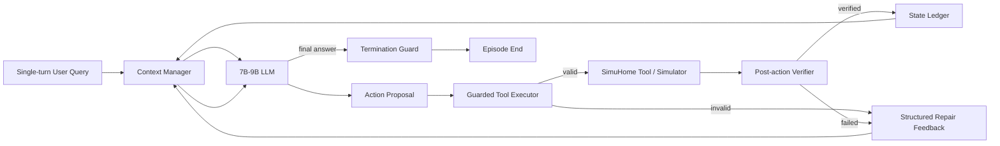
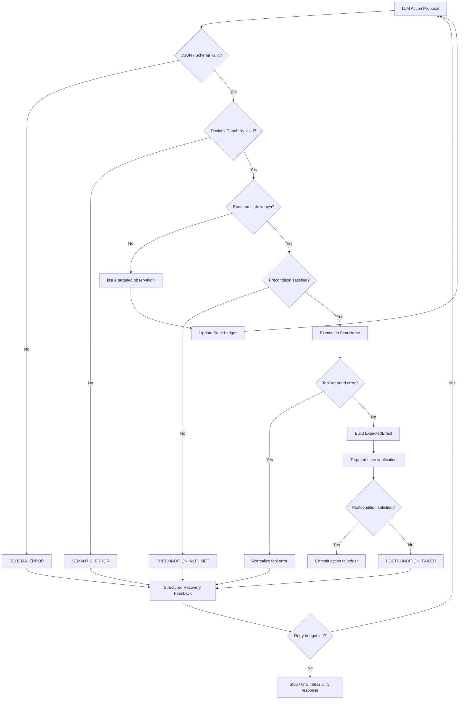

# 面向 SimuHome 单轮 Benchmark 的现代 Agent Harness 优化调研

## 执行摘要

本报告把目标严格限制在我们已经确定的范围：**不修改 SimuHome benchmark，不引入多轮用户对话、语音、用户记忆或缺参澄清，只优化单条用户指令进入之后的 Agent Harness。**这里的“单轮”并不意味着 Agent 只能调用一次工具；SimuHome 的每个 episode 从一条用户 query 开始，Agent 仍可在 ReAct loop 中进行多步查询、控制和 scheduling。论文 benchmark 包含 600 个 episode、六类 query type、feasible/infeasible 共十二个 evaluation category，每类 50 个。当前 GitHub 自带的 benchmark snapshot 已随新版 simulator 重新生成，因此**应以当前 repo snapshot 为实验基准，而不能直接拿自己的数值和论文 Table 1 横向比较**。citeturn13view1turn13view3

调研后的核心判断是：

> **对于一个 3–5 天、7B–9B 模型、目标是项目经历而不是论文的 MVP，最值得做的不是换一个更复杂的 planner，而是把“模型原本需要自己悟出来的运行时约束”下沉到 Harness。**

具体优先级如下：

| 优先级       | Harness 改动                                                             | 核心思想                                                                            | MVP 价值判断                                                     |
| ------------ | ------------------------------------------------------------------------ | ----------------------------------------------------------------------------------- | ---------------------------------------------------------------- |
| **P0** | **Guarded Tool Executor**                                          | JSON/schema → capability → state/precondition 三层 deterministic validation       | **最高。低成本，直接针对 SimuHome Device Control failure** |
| **P0** | **Verify → Repair Loop**                                          | action 后机械验证局部 postcondition；错误转换成结构化 feedback；bounded retry       | **最高。与 SimuHome 自身 error analysis 高度吻合**         |
| **P1** | **State-aware Context Manager**                                    | raw history → compact state ledger；JSON tool schema；只保留相关 observation/error | **高。尤其适合 7B–9B，小模型 context 更干净**             |
| P2           | Dynamic Tool Registration                                                | EcoAct/TinyAgent 式按需注册工具                                                     | 有价值，但先测 SimuHome tool schema 占比再决定                   |
| P2           | HiAgent-style hierarchical memory                                        | subgoal + working-memory pruning                                                    | 不建议 MVP 完整迁移；SimuHome 自己测试 HiAgent 是 mixed result   |
| P3           | AgentDebug / LLM verifier                                                | 再调用模型做 root-cause detection / verification                                    | 太重，会增加 token 与 latency，不适合本次 MVP                    |
| 排除         | PEC-Home / Audio2Tool / BFCL Missing Parameter / τ-bench user simulator | 多轮、省略、语音、用户模拟                                                          | **明确留作 future work**                                   |

这个选择并不是凭感觉。SimuHome 自身最关键的实验信号是：在显式设备控制 QT3 中，**超过 40% 的成功 episode 曾经历过一次 invalid tool call，然后依靠 tool feedback 恢复成功**；而 QT4 的 `schedule_workflow` 注册后只返回“注册成功”，不会告诉 Agent 未来 command 是否真的执行成功，因此缺失了这种 corrective signal。作者进一步给 Agent oracle failure feedback 后，QT4 的 recovery rate 可达到约 **55–67%**；反过来，仅靠“请自己 review/correct”的 self-correction，复杂 scheduling 上最高只有 18.5%，QT4-3 甚至是 0%。citeturn13view4turn13view5

这说明一个非常重要的 Harness Engineering 结论：

> **对 SimuHome 而言，“多想一遍”并不是低成本最优解；“把错误检测得更早、把错误反馈得更结构化”更值得做。**

同时必须保持克制：SimuHome 作者将 ReAct 换成 HiAgent 后，QT4-2/QT4-3 有提升、QT4-1 反而下降；作者最终判断 workflow scheduling 的瓶颈不能简单归咎于 ReAct scaffold。也就是说，我们的目标应该是**显著减少低级 tool/state errors，并争取带来总体 success-rate 增益**，而不是承诺靠三天 Harness 改造解决 QT4-3 的 temporal reasoning。citeturn13view4

### 本报告的工程假设

模型具体 checkpoint 尚未指定，因此实验假设为一个 **7B–9B instruction-tuned 模型**，使用固定 checkpoint、固定 decoding 参数，并通过 OpenAI-compatible endpoint 或等价接口运行。SimuHome 官方当前 example eval 使用 `react`、`temperature: 0.0`、`max_steps: 20`，并支持本地 OpenAI-compatible 模型 endpoint，因此可以保留该设置，只替换 strategy/harness。citeturn13view0

所有下文的“开发成本”和“预期指标变化”均为**基于论文 failure mode 与实现复杂度做出的工程估计**，不是这些论文已经在 SimuHome 上报告过的实验数字。

## SimuHome 基线与真正值得优化的接口

SimuHome 的 benchmark 强项不在 Harness 本身，而在 stateful simulator：设备基于 Matter 风格 API 工作，设备动作会持续改变温度、湿度等环境变量，workflow 可以在 virtual time 下执行，最终结果可以直接根据 simulator state 检验。论文当前版本明确把 state inquiry、implicit intent、explicit control 和三类 workflow scheduling 都纳入 benchmark。citeturn13view3turn13view4

官方 repo 的 evaluation example 仍然采用标准 ReAct strategy：

```yaml
strategy:
  name: react
  timeout: 60
  temperature: 0.0
  max_steps: 20
```

当前 benchmark 位于 `data/benchmark/`，repo 提供 `eval-start`、`eval-resume` 和 aggregation 命令，因此我们完全可以保持 simulator、episode、judge、model checkpoint 不变，只新增一个 harness strategy。citeturn13view0turn13view1

我们的实验变量因此应该非常干净：

```text
同一 user query
+ 同一 home initial state
+ 同一 model checkpoint
+ 同一 decoding
+ 同一 simulator
+ 同一 evaluator

唯一变量：

Official ReAct Harness
        vs.
Our Guarded / Verified Harness
```

### SimuHome 的 failure mode 给了我们明确靶点

论文的 error analysis 对项目设计非常重要。QT2 feasible failure 中，Device Control error 占主导，典型错误包括选错设备、发错 command、以及漏掉 operational dependency，例如设备应先 power on 再调整设置；QT4 feasible 则同时存在 Device Control、Temporal Reasoning 和 Action Planning 错误。citeturn13view4

因此我们应该把 failure 分成两类：

**Harness 可解决：**

```text
JSON / argument type 错
不存在的 device
设备不支持某 capability
value 超 range / enum
当前 state 不满足 command precondition
重复无效 action
tool error 没被结构化
command 执行后没有验证
旧 observation 污染 context
```

**Harness 很难在 3–5 天内真正解决：**

```text
复杂时间计算错误
两个以上设备的 coordinated scheduling
implicit intent 推断本身错误
长程 planning 本身能力不足
```

SimuHome 的结果也支持这个边界：reasoning model 在 QT2/QT4 更强，但复杂 coordinated scheduling 仍然困难，而且 extended reasoning 会显著增加 episode latency。citeturn13view4

所以我们的项目不应该讲成：

> “我发明了比 ReAct 更强的 planning algorithm。”

更严谨的定位是：

> **“I redesigned the runtime harness around a small LLM by introducing typed tool contracts, state-aware context management, deterministic action verification, and bounded recovery, reducing the amount of execution correctness that must be inferred by the model itself.”**

优化前后的系统边界如下：



最大的变化不是“多一层 LLM”，而是把原先：

```text
LLM → 希望它别犯错 → simulator
```

变成：

```text
LLM proposes
   ↓
Harness checks
   ↓
Simulator executes
   ↓
Harness verifies
   ↓
LLM only handles genuine reasoning/recovery
```

## 近期 Agent Harness 与 Tool-use 方法版图

下面只收录对本项目有实质意义的 2024–2026 工作。一个重要结论是：**很多近年 benchmark 的完整任务设置不适合直接迁移，但它们的 Harness 设计原则非常值得借。**

### 方法与开源项目概览

| 方法 / 项目                 |                 年份 | 核心内容与关键思想                                                                                                     | 官方论文 / Repo                                                                                                                                                                                                      |
| --------------------------- | -------------------: | ---------------------------------------------------------------------------------------------------------------------- | -------------------------------------------------------------------------------------------------------------------------------------------------------------------------------------------------------------------- |
| **ToolSandbox**       |     2024 / rev. 2025 | Stateful execution context；每轮 state snapshot；typed Python tools；异常直接回传 Agent，使其修正调用                  | [官方 GitHub](https://github.com/apple-aiml-research/ToolSandbox) citeturn19view0turn19view1                                                                                                                    |
| **BFCL / BFCL V4**    |                 2025 | executable function-call evaluation；AST/state-transition verification；系统研究 tool schema/output format sensitivity | [官方 Leaderboard](https://gorilla.cs.berkeley.edu/leaderboard.html) citeturn19view3turn20view0                                                                                                                 |
| **HiAgent**           |                 2024 | 用 subgoal 对 working memory 分块，只保留当前子目标相关 action-observation；动态 pruning                               | [官方 GitHub](https://github.com/HiAgent2024/HiAgent) citeturn16search2turn22view2                                                                                                                              |
| **EcoAct**            | 2024 / 2025 Workshop | 不在每一步把全部工具都塞入 context，而让 Agent 按需 register tools                                                     | [论文](https://arxiv.org/abs/2411.01643) / [Microsoft Research](https://www.microsoft.com/en-us/research/publication/ecoact-economic-agent-determines-when-to-register-what-action/) citeturn17view1turn18search12 |
| **TinyAgent**         |                 2024 | 面向 1.1B/7B 小模型的 function calling；tool retrieval 减少 prompt 长度，是典型 small-model-friendly 思路              | [论文](https://arxiv.org/abs/2409.00608) citeturn17view3                                                                                                                                                          |
| **ToolACE**           |     2024 / ICLR 2025 | Tool-learning 数据生成；dual-layer verification = rule checker + model checker；8B 级工具模型                          | [ICLR 官方页面](https://proceedings.iclr.cc/paper_files/paper/2025/hash/663865ea167425c6c562cb0b6bcf76c7-Abstract-Conference.html) citeturn17view2turn18search2                                                 |
| **AgentDebug**        |                 2025 | 对 trajectory 做模块化 error taxonomy、root-cause localization、targeted corrective feedback                           | [官方 GitHub](https://github.com/ulab-uiuc/AgentDebug) citeturn17view0turn22view3                                                                                                                               |
| **LLM-as-a-Verifier** |                 2026 | 把 verification 作为独立能力，对 Agent output 生成细粒度 feedback，无需额外训练                                        | [论文](https://arxiv.org/abs/2607.05391) citeturn22view0                                                                                                                                                          |
| **τ-bench**          |                 2024 | user-agent-tool interaction；最终 database state 对 goal state；提出 `pass^k` 衡量重复运行可靠性                     | [论文](https://arxiv.org/abs/2406.12045) citeturn19view4                                                                                                                                                          |
| **PEC-Home**          |                 2026 | SmartHome 渐进式省略指令、多用户偏好和动态偏好；主要是 multi-turn/context 问题                                         | [ACL Anthology](https://aclanthology.org/2026.findings-acl.999/) / [中文官方 README](https://github.com/BITHLP/PEC-Home) citeturn21view1turn21view3                                                                |
| **Audio2Tool**        |                 2026 | 约 3 万条 Smart Home / Car / Wearable speech tool-use query，覆盖复杂语音与组合指令                                    | [论文](https://arxiv.org/abs/2604.22821) / [数据集](https://huggingface.co/datasets/RVtech/Audio2Tool) citeturn22view1turn21search7                                                                                |
| **SimuHome**          |     2025 / ICLR 2026 | 本项目环境；dynamic state、Matter-style device control、workflow scheduling、virtual time                              | [官方 GitHub](https://github.com/holi-lab/SimuHome) citeturn13view1turn13view3                                                                                                                                  |

### 对 SimuHome 的实际迁移价值

#### ToolSandbox：非常值得借，但不要迁整个框架

ToolSandbox 的 execution context 显式存储 tools、dialog 和 world state，并在每 turn 保存 state snapshot。更重要的是，官方工具实现直接使用 typed checks；执行环境捕获 exception 后，会把异常返回给 Agent，让它 refine tool call 再尝试。citeturn19view0

这和 SimuHome 非常契合：

```text
ToolSandbox
LLM proposal
 → typed runtime validation
 → execution
 → exception / state feedback
 → retry
```

可以迁成：

```text
SimuHome
LLM proposal
 → schema validation
 → capability validation
 → state/precondition validation
 → execution
 → structured feedback
 → retry
```

**开发成本：低。预期 impact：高。**

不需要引入它的 user simulator、role system 或整个 benchmark。

#### BFCL：对 7B–9B 最有用的不是 benchmark，而是 format engineering

BFCL V4 的 format-sensitivity 实验在 200 个 single-turn test case 上比较不同 tool representation；官方报告显示，小模型尤其倾向于在 **JSON/Python output** 下表现优于 XML，tool documentation 以 **JSON** 表示时整体表现最好；Llama-3.1-8B-Instruct、BitAgent-8B 等小模型在要求额外 XML-style tool tags 时出现明显下降。citeturn20view0turn20view3

这对我们的意义非常直接：

> **7B–9B 模型不要承担不必要的 syntax burden。**

因此 MVP 应尽量采用：

```json
{
  "name": "set_device_state",
  "parameters": {
    "type": "object",
    "properties": {
      "device_id": {"type": "string"},
      "temperature": {"type": "number"}
    },
    "required": ["device_id", "temperature"]
  }
}
```

而不是额外设计：

```xml
<TOOLCALL>
  ...
</TOOLCALL>
```

BFCL 的 Missing Parameters 等 multi-turn 类别与当前 scope 不一致，所以**不迁任务，只迁 schema/prompt discipline**。BFCL 当前 leaderboard 本身也把 accuracy、cost、latency纳入统一评估，值得模仿其工程指标意识。citeturn19view2turn19view3

#### EcoAct 与 TinyAgent：有价值，但“完整 dynamic tool retrieval”不是第一优先级

EcoAct 指出传统 Agent 往往把所有 candidate tools 长期放在 context 中，它将 tool registration 纳入 reasoning，根据当前需要选择工具；论文报告在其 multi-step benchmark 设置中可降低超过 50% 的 computation cost，同时维持表现。这个数值**不能直接外推到 SimuHome**，但“减少 irrelevant tool context”的原则有明确依据。citeturn17view1

TinyAgent 更直接面向小模型，论文训练 1.1B 和 7B 模型，并通过 tool retrieval 缩短 input prompt。citeturn17view3

但这里有一个重要工程判断：

> 如果 SimuHome 实际注册给 Agent 的 tool schema 本来就很少，那么实现向量检索 / dynamic registration 的 ROI 可能并不高。

因此 Day 1 应先 instrumentation：

```text
tool_schema_tokens / total_input_tokens
```

若 tool schema 已经占明显比例，再做 tool pruning；否则先做 **observation/history pruning**。

**完整 EcoAct：Medium dev cost。
借用其 context economy 原则：Low dev cost。**

#### HiAgent：理念值得借，完整实现不值得 MVP 搬

HiAgent 的核心是用 subgoal 管理 working memory，而不是把所有 action-observation pair 永久放回模型。官方 repo 描述了 hierarchical memory、dynamic updating/pruning 和 structured memory。citeturn16search2turn22view2

但 SimuHome 本身已经专门测试过 HiAgent：QT4-2 和 QT4-3 比 ReAct 好，QT4-1 却更差，整体结果 mixed。citeturn13view4

这给我们一个很好的信号：

**不要复制 HiAgent planner；只借它的 memory pruning。**

也就是：

```text
不要：
完整 trajectory 全量回灌

要：
user goal
+ current known state
+ unresolved constraint
+ recent relevant actions
+ latest error
```

这可以在不到一天里实现，而完整 hierarchical planner 至少会把项目复杂度提高一个量级。

#### ToolACE：真正值得借的是“分层 verification”

ToolACE 的贡献主体是训练数据 pipeline，但它用了 dual-layer verification：rule-based checker + model-based checker，以确保 function-call 数据 executable 和 consistent。citeturn17view2turn18search26

这启发我们把 verification 拆成：

```text
cheap deterministic verifier
        ↓ only if necessary
expensive semantic/model verifier
```

但本次 SimuHome 大量约束是结构化的 device state、capability、range、time 和 tool error，所以 **MVP 只实现第一层**。不要为了“现代”强塞第二个 LLM verifier。

#### AgentDebug：概念非常强，但完整版本对 MVP 太重

AgentDebug 把错误分到 memory、reflection、planning、action、system 等模块，并通过 two-stage pipeline 定位 critical root cause，再给 targeted feedback；论文在其 benchmark 中报告 corrective feedback 可以提高后续任务恢复表现。citeturn17view0turn22view3

问题在于官方实现本身需要额外模型分析 trajectory，属于：

```text
Agent LLM
   +
Debugger LLM
```

对于我们强调低 latency 的 7B–9B SimuHome 项目不划算。

但可以借一个原则：

> **反馈必须指出具体错误类型，而不是只给 `"tool failed"`。**

例如：

```json
{
  "error_code": "PRECONDITION_NOT_MET",
  "tool": "set_temperature",
  "device": "ac_01",
  "expected": "power=on",
  "actual": "power=off",
  "retryable": true
}
```

这就是一个极低成本的“AgentDebug-lite”。

#### LLM-as-a-Verifier：是前沿方向，但本次应作为 future ablation

2026 年的 LLM-as-a-Verifier 把 verification 明确提出为独立 scaling axis，通过模型给 agentic task 产生 fine-grained verification feedback，并报告了多个 Agent/软件/机器人 benchmark 上的结果。citeturn22view0

但 SimuHome 正好拥有结构化、可查询的环境状态。

所以：

> **能 deterministic verify 的地方，用第二个 LLM 是浪费。**

未来可以在 implicit intent、复杂 temporal plan 这类 deterministic rule 难覆盖的地方试 LLM verifier；MVP 不做。

#### τ-bench：只借 evaluator 思路

τ-bench 的核心环境是 multi-turn user-agent-tool，不符合当前 scope；但它有两个值得借的 eval 思想：根据最终 database state 与 annotated goal 比较，而不是只看 final answer；以及用 `pass^k` 表示多次运行的一致可靠性。citeturn19view4

前者 SimuHome 本来就在做；后者可以作为 optional robustness metric。

#### PEC-Home 与 Audio2Tool：明确排除

PEC-Home 研究的是 progressive ellipsis、multi-user preference 和 dynamic preference；官方中文 README 也明确说明重点是共享上下文不断积累后指令逐渐被省略。citeturn21view1turn21view3

Audio2Tool 则是 SpeechLM/tool-use benchmark，约 3 万 query，重点是 Smart Home 等领域中的 speech、noise、多意图和 acoustic/compositional difficulty。citeturn22view1

两者对真实产品都很重要，但它们改变了**任务定义**，而我们现在只想改变 **Harness**。

因此全部进入 Future Work，不占 MVP 一分钟。

### 综合迁移排序

以下“预期影响”是本报告的工程 prior，而非原论文在 SimuHome 上的实测。

| 方法                               | 年份 | Repo / 来源                                        | 开发成本               | 预期影响                                        | 对 SimuHome 的决定      |
| ---------------------------------- | ---: | -------------------------------------------------- | ---------------------- | ----------------------------------------------- | ----------------------- |
| ToolSandbox-style typed execution  | 2024 | 官方 GitHub citeturn19view0                  | **低**           | success ↑；invalid execution ↓↓；latency ≈  | **立即做**        |
| BFCL JSON/schema discipline        | 2025 | BFCL V4 citeturn20view0                      | **极低**         | invalid formatting ↓；small-model stability ↑ | **立即做**        |
| ToolACE rule verification          | 2025 | ICLR citeturn18search2                       | **低**           | invalid calls ↓↓；success ↑                  | **立即做**        |
| AgentDebug-style structured errors | 2025 | 官方 Repo citeturn22view3                    | **低**（简化版） | recovery ↑；重复失败 ↓                        | **立即做简化版**  |
| HiAgent memory pruning             | 2024 | 官方 Repo citeturn22view2                    | 低–中                 | tokens ↓；steps 可能 ↓；success 不确定        | **只借 pruning**  |
| EcoAct dynamic registration        | 2024 | 论文/MSR citeturn17view1turn18search12     | 中                     | tokens ↓↓；latency ↓；误过滤风险             | **先测再做**      |
| TinyAgent tool retrieval           | 2024 | 论文 citeturn17view3                         | 中                     | 小模型 tool selection ↑；tokens ↓             | **可选 ablation** |
| AgentDebug full pipeline           | 2025 | Repo citeturn22view3                         | 高                     | recovery ↑；tokens/latency ↑↑                | **MVP 不做**      |
| LLM-as-a-Verifier                  | 2026 | 论文/code citeturn22view0                    | 中–高                 | semantic verification ↑；latency ↑↑          | **future**        |
| τ-bench user simulator            | 2024 | 论文 citeturn19view4                         | 高                     | 改变 task definition                            | **不做**          |
| PEC-Home                           | 2026 | 官方 Repo citeturn21view3                    | 高                     | 解决 multi-turn ellipsis                        | **不在 scope**    |
| Audio2Tool                         | 2026 | 官方项目/数据 citeturn22view1turn21search7 | 高                     | 语音鲁棒性                                      | **不在 scope**    |

## 推荐的 Harness 设计

最终建议不是十种 feature，而是**三个相互配合、可以分别 ablation 的模块**：

```text
Context Manager
        ↓
Small LLM
        ↓
Guarded Executor
        ↓
SimuHome
        ↓
Verifier
        ↓
State Ledger / Structured Error
        ↺
```

这样既够“现代”，又不会变成论文工程。

### Guarded Tool Executor：把 tool correctness 从 LLM 下沉到 runtime

这是最优先实现的模块。

ToolSandbox 已证明 stateful tool environment 完全可以在 execution layer 做 typed validation，并把具体 exception 回传给 Agent；ToolACE 则进一步展示了 rule checker + model checker 的 layered verification 思路。citeturn19view0turn17view2

#### 数据 schema

建议定义一个统一 `ToolContract`：

```python
class ToolContract(BaseModel):
    name: str
    description: str

    # Standard JSON Schema
    parameters: dict

    # Harness metadata
    category: Literal["query", "control", "schedule"]
    side_effect: bool

    # Optional constraints derived from tool/device metadata
    supported_device_types: list[str] = []
    preconditions: list["Precondition"] = []
    postconditions: list["Postcondition"] = []
```

LLM 只生成最小 `ActionProposal`：

```python
class ActionProposal(BaseModel):
    action_id: str
    tool: str
    arguments: dict
```

validator 返回的不是 Python exception string，而是统一结果：

```python
class ValidationIssue(BaseModel):
    code: Literal[
        "SCHEMA_ERROR",
        "UNKNOWN_TOOL",
        "UNKNOWN_DEVICE",
        "UNSUPPORTED_CAPABILITY",
        "VALUE_OUT_OF_RANGE",
        "PRECONDITION_UNKNOWN",
        "PRECONDITION_NOT_MET",
        "INVALID_TIME",
        "INVALID_WORKFLOW"
    ]

    message: str
    retryable: bool

    expected: object | None = None
    actual: object | None = None

    suggested_tool: str | None = None
    suggested_arguments: dict | None = None


class ValidationResult(BaseModel):
    decision: Literal[
        "EXECUTE",
        "OBSERVE",
        "REPAIR",
        "REJECT"
    ]

    normalized_action: ActionProposal | None
    issues: list[ValidationIssue]
```

这个 schema 的关键不是 Pydantic 本身，而是：

> **Harness 必须能区分“模型生成错了”“我还不知道 state”“当前 state 明确不允许执行”。**

不能把三者统统表示成：

```text
Error
```

#### 校验层级

建议严格按便宜到昂贵的顺序：

```text
Layer A
Syntax / JSON / required fields / types

        ↓

Layer B
Semantic
device exists?
capability exists?
range / enum legal?

        ↓

Layer C
Known-state precondition
power on?
correct mode?
prerequisite state known?

        ↓

Layer D
Execute in SimuHome
```

如果某个 precondition **未知**：

```text
不要猜 false
不要猜 true
```

而是：

```json
{
  "decision": "OBSERVE",
  "issues": [{
    "code": "PRECONDITION_UNKNOWN",
    "suggested_tool": "get_device_state",
    "suggested_arguments": {
      "device_id": "ac_01"
    }
  }]
}
```

这特别适合 7B–9B，因为你不再要求模型自己在 prompt 里记住：

> “等等，我是不是应该先查一下 AC power？”

SimuHome 的 error analysis 明确表明遗漏 operational dependency 是 Device Control failure 的重要组成部分。citeturn13view4

#### 一个重要反作弊边界

Validator **绝对不能读取 benchmark hidden goal**。

允许读取的是：

```text
public tool schema
device metadata
已经 observation 到的 state
simulator API 返回值
action arguments
```

不允许：

```text
episode expected answer
evaluator goal state
gold trajectory
```

否则提升不能算 Harness improvement，而是 benchmark leakage。

#### 对 scheduling 的处理

`workflow` 应对内部 command 做递归 schema validation：

```python
for command in workflow.commands:
    validate_schema(command)
    validate_device_capability(command)
    validate_value_range(command)

validate_schedule_time(workflow.start_time)
```

但不要声称 Harness 知道未来 dynamic environment 一定是什么状态。SimuHome 恰恰强调 schedule registration 与未来 execution 之间可能发生状态变化，因此静态 validator 只能检查**当前可证明的合法性**。citeturn13view4

### State-aware Context Manager：减少小模型需要同时追踪的信息

HiAgent 证明了 full action-observation history 在 long-horizon agent 中可能产生冗余，并通过 subgoal-based working-memory pruning 改善表现；EcoAct 和 TinyAgent 则分别从 tool registration 和 tool retrieval 角度减少 irrelevant context。citeturn16search2turn17view1turn17view3

我们不需要完整复制任何一个。

建议构建一个确定性的 `StateLedger`：

```python
class Fact(BaseModel):
    entity: str
    field: str
    value: object

    observed_at_step: int
    source_tool: str


class StateLedger(BaseModel):
    user_request: str

    known_facts: list[Fact]

    # Device / environment facts relevant to current trajectory
    active_entities: list[str]

    # Compact history
    completed_actions: list[str]

    # Keep error evidence explicitly
    last_error: ValidationIssue | None

    # Important scheduling information must never be pruned
    temporal_constraints: list[dict]

    # The latest raw observation can optionally be retained
    latest_observation: dict | None
```

假设 raw tool output 是：

```json
{
  "device_id": "bedroom_ac_1",
  "name": "Air Conditioner",
  "power": "on",
  "mode": "cool",
  "target_temperature": 24,
  "fan_speed": 2,
  "manufacturer": "...",
  "cluster_info": "...",
  "metadata": "... lots more ..."
}
```

给下一轮 LLM 的 context 可以变为：

```json
{
  "goal": "用户原始 query，完整保留",
  "known_state": {
    "bedroom_ac_1": {
      "power": "on",
      "mode": "cool",
      "target_temperature": 24
    }
  },
  "last_action": "...",
  "last_error": null
}
```

原则是：

> **不是 LLM summary，而是 deterministic extraction。**

因为用另一个 LLM 来“总结 observation”会重新引入 hallucination、token 和 latency。

#### Tool schema 也做 canonicalization

BFCL V4 的直接证据非常适合这里：小模型在 JSON/Python 输出上一般优于 XML，而 tool documentation 使用 JSON 时整体更好；额外 XML-style tags 对某些 8B 模型尤其不友好。citeturn20view0turn20view3

所以统一：

```text
Tool documentation → JSON Schema
Tool proposal      → native tool call or JSON
Validation errors  → JSON
State ledger       → JSON
```

而不是四种不同表示方式。

#### 要不要做 dynamic tool selection

先记录：

```text
input_tokens
tool_schema_tokens
observation_tokens
history_tokens
```

只有当 `tool_schema_tokens` 真的是主要开销时，才实现 EcoAct/TinyAgent 风格 top-k tool selection。

MVP 若实现，建议使用 **soft filtering**：

```text
always_visible:
  device discovery
  state query
  generic error recovery

conditionally_visible:
  control family
  schedule family
```

并保留 fallback：

```text
没有合适工具
或连续失败
→ expand full tool catalog
```

而不是一次 router 判断错了以后彻底把正确工具藏掉。

### Verify → Repair Loop：项目最值得讲的部分

这是我认为最后最有项目故事价值的一项。

SimuHome 已直接证明：即时 tool feedback 能让 QT3 Agent 从初始错误中恢复，而 scheduled workflows 缺 feedback 时 recovery 显著困难。citeturn13view4turn13view5

我们的 Harness 可以不借助 hidden benchmark goal，直接从 action 本身机械构造一个 **ExpectedEffect**：

```python
class ExpectedEffect(BaseModel):
    action_id: str
    entity: str

    field: str
    comparator: Literal[
        "eq",
        "contains",
        "exists",
        "registered"
    ]

    expected: object

    verification_mode: Literal[
        "immediate",
        "after_execution",
        "registration_only"
    ]
```

例如：

```json
Action:
{
  "tool": "set_target_temperature",
  "arguments": {
    "device": "ac_01",
    "temperature": 24
  }
}
```

自动转换：

```json
ExpectedEffect:
{
  "entity": "ac_01",
  "field": "target_temperature",
  "comparator": "eq",
  "expected": 24,
  "verification_mode": "immediate"
}
```

注意我们验证的是：

```text
device.target_temperature == 24
```

而不是：

```text
room.temperature == 24
```

因为后者是一个随着环境 dynamics 逐渐变化的物理结果，不能在 action 后立即断言。SimuHome 本身就是为了建模这种连续环境变化。citeturn13view1turn13view4

#### Verification / recovery flow



#### Error recovery policy

不要让所有错误都简单 `retry()`。

| Error type                      | Harness strategy                        |
| ------------------------------- | --------------------------------------- |
| `SCHEMA_ERROR`                | 给出字段级错误，允许同一 action repair  |
| `UNKNOWN_DEVICE`              | 提示先执行 discovery，而不是猜设备      |
| `UNSUPPORTED_CAPABILITY`      | 返回实际 capability；要求 replan        |
| `PRECONDITION_UNKNOWN`        | Harness 自动/建议 targeted observation  |
| `PRECONDITION_NOT_MET`        | 将 expected/actual 显式反馈给模型       |
| `VALUE_OUT_OF_RANGE`          | 返回允许区间/enum                       |
| simulator exception             | normalize 成统一 ErrorEnvelope          |
| `POSTCONDITION_FAILED`        | refresh affected device state → replan |
| 同一 normalized action 连续失败 | 禁止盲重试，强制 refresh/replan         |
| 超过 retry budget               | 终止 recovery，避免 infinite loop       |

建议：

```text
max_recovery_attempts_per_action = 2
```

而不是无限循环。

#### Loop pseudocode

```python
def run_episode(query: str):
    state = RuntimeState.from_query(query)

    for step in range(MAX_STEPS):
        context = context_manager.render(state)

        proposal = model.generate_action(context)

        # Model wants to finish.
        if proposal.is_final:
            if state.has_unresolved_execution_failure:
                state.add_feedback(
                    code="UNRESOLVED_FAILURE",
                    message="Last requested action has not been verified."
                )
                continue

            return proposal.final_answer

        validation = validator.validate(
            action=proposal,
            observed_state=state.ledger
        )

        if validation.decision == "OBSERVE":
            result = executor.execute(
                validation.issues[0].suggested_tool,
                validation.issues[0].suggested_arguments
            )
            state.update_observation(result)
            continue

        if validation.decision in {"REPAIR", "REJECT"}:
            state.add_feedback(validation)
            state.consume_recovery_budget()
            continue

        pre_state = state.snapshot_relevant(proposal)

        result = executor.execute(validation.normalized_action)

        if result.failed:
            state.add_feedback(
                normalize_tool_error(result)
            )
            continue

        state.update_observation(result)

        if verifier.should_verify(proposal):
            expectation = verifier.derive_expectation(proposal)

            post_state = targeted_state_refresh(
                expectation.entity
            )

            verdict = verifier.compare(
                expectation,
                post_state
            )

            if not verdict.ok:
                state.add_feedback(verdict)
                state.consume_recovery_budget()
                continue

        state.commit_success(proposal)

    return terminate_with_step_limit()
```

这个设计有一个很重要的特点：

> **Harness 不替 LLM plan；Harness 只保证 LLM 的 plan 在进入真实 execution path 前后有结构化约束和反馈。**

所以仍然是 Agent 项目，而不是把 benchmark hard-code 掉。

### 三个优化的预期 trade-off

| 模块             | Success rate            | Invalid tool calls | Steps   | Tokens              | Latency                 | 风险                        |
| ---------------- | ----------------------- | ------------------ | ------- | ------------------- | ----------------------- | --------------------------- |
| Guarded Executor | ↑ 中                   | **↓ 高**    | ↓ / ≈ | ≈                  | ≈                      | 规则过严会 false reject     |
| Context Manager  | ↑ 低–中               | ↓ 低              | ↓ 低   | **↓ 中–高** | ↓ 潜在                 | pruning 丢失关键信息        |
| Verify → Repair | **↑ 中–高潜力** | ↓ 中              | 可能 ↑ | 可能 ↑ 少量        | **↑ 少量–中等** | verification 本身增加 query |
| Full EcoAct      | ↑/≈                   | ↓?                | ≈      | ↓↓                | ↓潜在                  | tool recall 错误            |
| Full AgentDebug  | ↑潜力                  | ↓                 | ↑      | ↑↑                | ↑↑                    | 不符合实时、小模型目标      |
| LLM verifier     | ↑潜力                  | ↓                 | ↑      | ↑↑                | ↑↑                    | 多一次模型推理              |

这里最值得关注的是：**steps 不是越少越好。**

例如：

```text
baseline:
wrong action → wrong final
2 steps

ours:
validate → state query → corrected action → verify
4 steps
```

虽然 steps 上升，但 episode success 上升，这显然是好事。

因此 eval 不能只看平均 steps。

## 实验设计与统计方案

### 固定 benchmark，不造任何新数据

SimuHome 论文 benchmark 是十二个 evaluation categories，每类 50 episode，共 600；当前 repo 内置 reproducible benchmark snapshot，但 simulator 更新后已经不是论文原始 Table 1 所使用的完全相同 snapshot。citeturn13view1turn13view3

因此实验规则应为：

```text
data/benchmark/
        ↓
固定 episode IDs
        ↓
所有 Harness variant 跑完全相同 episode
```

**不调用 episode generator。
不加入自己写的模糊 query。
不引入 PEC-Home/Audio2Tool/BFCL data。**

### MVP sample 设计

为了 3–5 天现实可行，我建议三级规模：

| 阶段             |      Episodes | 采样方式              | 用途                                |
| ---------------- | ------------: | --------------------- | ----------------------------------- |
| Smoke test       |        12–24 | 每个 category 1–2 个 | 查代码 bug                          |
| Development eval | **120** | 十二类各 10 个        | 快速比较 architecture               |
| Final MVP eval   | **192** | 十二类各 16 个        | 接近用户要求的 ≤200 规模且完全平衡 |
| Optional final   |           600 | 全 benchmark          | 时间/算力允许再跑                   |

为什么不要“随便抽 100 个”？

因为 QT1、QT2、QT3、QT4 难度差异很大，而 feasible/infeasible 的 failure mode 也不同。论文明确显示 QT2 和 QT4 显著更困难。citeturn13view4

因此要做：

```text
stratified by query type × feasibility
```

并在看结果前固定 seed 和 episode manifest。

BFCL 自己的 format-sensitivity work 也采用固定的 200 个 single-turn 子集，并验证其与更大测试集结果有强相关性；这不能证明“SimuHome 192 条一定代表全部 600 条”，但支持了“先用固定、覆盖各类别的较小 subset 做工程迭代”的一般实践。citeturn20view0

### Baseline 与 ablation

至少跑：

```text
B0  Official ReAct
    ↓
B1  + JSON / Guarded Tool Executor
    ↓
B2  + State-aware Context Manager
    ↓
B3  + Verify → Repair
```

最终：

```text
Full = B1 + B2 + B3
```

这样面试时不能只说：

> “加了一堆东西，从 43% 到 51%。”

而可以说：

> “Schema/state validation 主要减少 invalid execution；context manager 主要降低 tokens；verification/recovery 才是对 success rate 帮助最大的模块。”

这才是真正有工程分析含量。

### 主指标

**Episode Success Rate** 是第一指标，因为 SimuHome 最终基于可验证目标/环境状态评价任务。citeturn13view3

建议完整记录：

```text
success_rate
success_rate_by_QT
success_rate_feasible
success_rate_infeasible
```

其次是 Harness-specific metrics：

```text
invalid_action_proposal_rate
invalid_action_executed_rate
first_try_valid_rate
recovery_success_rate
postcondition_failure_rate
repeated_error_rate
```

尤其区分：

```text
invalid proposed
vs.
invalid reaching simulator
```

因为 Guard 的目的不是让 LLM 一夜之间不犯错，而是：

> **不让错误 action 直接穿透 execution boundary。**

### 效率指标

BFCL leaderboard 已经把 cost 和 latency 作为 tool-use evaluation 的重要维度展示；SimuHome 自己也指出复杂 reasoning 会导致明显 latency 成本。citeturn19view3turn13view4

所以至少记录：

```text
mean / median tool calls
mean agent steps

input tokens
output tokens
tool schema tokens
history / observation tokens

episode latency
LLM latency
Harness CPU latency

extra verification tool calls
```

一个很重要的最终图是：

```text
                Success
                   ↑
                   │        ● Full Harness
                   │
                   │   ● Guard
                   │
                   │ ● Baseline
                   └────────────────→ latency / tokens
```

你真正希望展示的是：

> **不是无限增加 inference compute，而是在比较小的 latency/token overhead 下，提高 execution reliability。**

### Failure taxonomy

直接把失败归类：

```text
FORMAT
TOOL_SELECTION
ARGUMENT
DEVICE_SELECTION
CAPABILITY
PRECONDITION
TEMPORAL
PLANNING
POSTCONDITION
TERMINATION
STEP_LIMIT
```

其中 `TEMPORAL / PLANNING` 可以作为“仍然没解决”的 failure。

这反而让结果更可信。

例如最终可能发现：

```text
Device control errors:
baseline  31
ours      12

Temporal reasoning errors:
baseline  18
ours      17
```

那么结论应该是：

> Harness 显著改善 execution correctness，但没有真正解决 temporal reasoning。

这是一个非常干净的工程结论，且与 SimuHome 自身对 model capability bottleneck 的观察一致。citeturn13view4

### 统计检验

因为不同 Harness 在**同一批 episode**上运行，这是 paired experiment。

Episode success 是 binary：

```text
Baseline episode i = success / fail
Our harness episode i = success / fail
```

最合适的核心检验是 **McNemar test**，重点看：

```text
baseline fail → ours success
vs.
baseline success → ours fail
```

同时报告：

```text
absolute success-rate difference
paired bootstrap 95% CI
```

对于：

```text
steps
tool calls
token count
latency
invalid-call count
```

它们很可能不是正态分布，MVP 中可以使用 paired bootstrap 或 Wilcoxon signed-rank，并同时报告 median/mean change。

如果同时做 B0/B1/B2/B3 多次 hypothesis test，可做 Holm correction，避免因为测了很多 variant 而偶然得到显著结果。

不过需要正确解读 120–192 条的统计能力：

> **它适合证明“这是一个明显的工程趋势”，不适合把两三个百分点的小变化包装成论文级结论。**

### 可选 reliability test

τ-bench 提出的 `pass^k` 思路是关注 Agent 多次执行是否可靠，而不是“有一次做对”。citeturn19view4

如果最后还有时间，可以挑：

```text
30 个 QT2/QT4 hard episodes
×
3 random seeds
```

看：

```text
all-pass rate
success variance
```

但这是 optional；**不要为了这个影响 192-episode 主实验。**

## MVP 实施路线与最小交付物

核心原则是：

> **先复现和 instrumentation，再加 guard，再加 verify，context optimization 最后围绕真实 token trace 做。**

不要一上来重构整个 Agent。

### Day One：锁死 baseline 和 observability

目标不是“开始优化”，而是确认我们知道 baseline 在干什么。

完成：

```text
clone SimuHome
启动 simulator
固定一个 7B–9B checkpoint
跑通官方 react strategy

固定 120-episode manifest

记录：
episode_id
query_type
feasible
success
steps
tool_calls
tool_errors
input_tokens
output_tokens
latency
trajectory
```

官方 repo 当前 baseline example 已提供 `react`、`temperature: 0.0`、`max_steps: 20` 和本地 API endpoint 接口，可以直接复用。citeturn13view0

当天最小交付：

```text
baseline_results.jsonl
episode_manifest.json
baseline_summary.csv
1 个失败 trajectory 的人工分析
```

**Day One 结束前不写复杂 Harness。**

因为你首先需要回答：

> 我的小模型究竟主要死在 tool formatting、wrong device、precondition，还是 temporal planning？

### Day Two：Guarded Tool Executor

实现：

```text
ToolContract
ActionProposal
ValidationResult
ErrorEnvelope

schema validation
device validation
capability validation
range/enum validation
known-state precondition validation
```

统一 tool/error representation 为 JSON；这个选择与 BFCL 对 small-model format sensitivity 的实验结论一致。citeturn20view0turn20view3

当天跑：

```text
B0 vs B1
same 120 episodes
```

重点指标：

```text
invalid proposed
invalid executed
success
recovery
```

最小交付：

```text
validator.py
contracts.py
structured_errors.py
B1_results.jsonl
```

### Day Three：State Ledger 与 Context Budget

先检查 Day One trace：

```text
tool schemas 占多少 token？
raw observations 占多少？
history 占多少？
```

然后只解决最大的那个。

默认实现：

```text
StateLedger
ObservationNormalizer
ContextRenderer
```

保留：

```text
原始 user goal
known device facts
known environment facts
temporal constraints
latest error
compact action history
latest relevant observation
```

删除重复 raw history。

如果 tool schema 占比真的大，再做 simple tool-family filtering；否则不要为了 EcoAct 这个名字强行加 retrieval。

当天比较：

```text
B0
B1 Guard
B1 + Context
```

重点不是只看 success，而是：

```text
tokens per step
tokens per episode
latency
success regression
```

如果 token 降了但 success 明显下降：

> **立刻 rollback aggressive pruning。**

这也是为什么建议 deterministic state ledger，而不是复杂 memory model。

### Day Four：Verify → Repair

实现：

```text
ExpectedEffect
ActionVerifier
RecoveryPolicy
retry_budget
termination_guard
```

优先支持最简单的 deterministic postcondition：

```text
power state
mode
setpoint
brightness
workflow registration metadata
其它直接 device state
```

随后再支持 scheduling 的 nested command preflight。

当天测试：

```text
失败 action
→ Harness 是否检测
→ structured error
→ LLM 是否成功 replan
```

最值得保留的 demo trajectory 是：

```text
Baseline:
错误 command
→ Agent 没意识到
→ episode failed

Ours:
同样错误 proposal
→ validator/verifier 检测
→ structured feedback
→ model recovery
→ episode success
```

这就是整个项目最强的一张图。

### Day Five：最终 ablation 与项目包装

跑固定的 **192 episodes**：

```text
B0 Official ReAct
B1 Guard
B2 Guard + Context
B3 Full Harness
```

生成：

```text
overall success table
per-QT success table
invalid tool-call table
recovery table
steps/tokens/latency table
failure taxonomy
McNemar p-value
bootstrap CI
```

如果算力和时间仍充足，再把 Full 与 Baseline 跑到全部 600 episode。

最终最小目录可以长这样：

```text
simuhome-harness/
├── harness/
│   ├── contracts.py
│   ├── validator.py
│   ├── state_ledger.py
│   ├── context_manager.py
│   ├── verifier.py
│   └── recovery.py
│
├── strategies/
│   ├── react_baseline.py
│   └── guarded_react.py
│
├── eval/
│   ├── episode_manifest.json
│   ├── metrics.py
│   └── stats.py
│
├── results/
│   ├── baseline.jsonl
│   ├── guard.jsonl
│   ├── context.jsonl
│   └── full.jsonl
│
└── README.md
```

如果最后只能做 **三天**，直接砍掉：

```text
dynamic tool retrieval
full HiAgent memory
model-based verifier
AgentDebug integration
RL
multi-turn
voice
custom dataset
```

保留：

```text
Day 1 baseline + metrics
Day 2 Guard
Day 3 Verify/Recovery + 120 episode ablation
```

这仍然已经是一个完整的 Agent Harness 项目。

### 项目最终应该怎么描述

比起：

> “Implemented a SmartHome Agent with ReAct.”

更有内容的版本是：

> **Built and optimized a small-model Agent Harness on the SimuHome ICLR benchmark, introducing typed tool contracts, state-aware context management, deterministic precondition/postcondition verification, and bounded error recovery. Evaluated the harness against the original ReAct baseline under the same model and simulator using episode success, invalid tool calls, recovery rate, token usage, and latency.**

真正强的地方不是 feature 数量，而是你能够解释：

```text
LLM 应该负责什么？
Harness 应该负责什么？

为什么 schema correctness
不应该交给 LLM？

为什么 tool success
不等于 task success？

为什么 observation
不是越多越好？

为什么 error feedback
是 Agent loop 的一部分？

为什么 verify
不能读取 hidden benchmark goal？

为什么 recovery
必须 bounded？

为什么 success 提升
要和 latency/token 一起看？
```

这已经足够让这个项目从“跑了一个 toy ReAct demo”，升级为一个**有明确实验变量、有 failure analysis、有 architecture trade-off 的 Agent Engineering 项目**。

### 优先阅读资料

按“对这个 3–5 天项目的实际价值”而不是论文名气排序：

| 优先级           | 来源                                                                                                                                                           | 本项目应该重点看什么                                            |
| ---------------- | -------------------------------------------------------------------------------------------------------------------------------------------------------------- | --------------------------------------------------------------- |
| **最高**   | [SimuHome 官方 GitHub](https://github.com/holi-lab/SimuHome) citeturn13view1                                                                                | repo 当前 benchmark、ReAct strategy、eval pipeline              |
| **最高**   | [SimuHome 论文](https://arxiv.org/abs/2509.24282) citeturn13view4                                                                                           | § Error Analysis、Tool Feedback、framework ablation            |
| **最高**   | [ToolSandbox 官方 GitHub](https://github.com/apple-aiml-research/ToolSandbox) citeturn19view0                                                               | execution context、typed tools、exception feedback              |
| **最高**   | [BFCL V4 Format Sensitivity](https://gorilla.cs.berkeley.edu/blogs/17_bfcl_v4_prompt_variation.html) citeturn20view0                                        | JSON schema、small-model formatting、prompt/tool representation |
| **高**     | [ToolACE — ICLR 2025](https://proceedings.iclr.cc/paper_files/paper/2025/hash/663865ea167425c6c562cb0b6bcf76c7-Abstract-Conference.html) citeturn18search2 | dual-layer verification；借 rule verifier 思路即可              |
| **高**     | [AgentDebug 官方 Repo](https://github.com/ulab-uiuc/AgentDebug) citeturn22view3                                                                             | structured error taxonomy 和 targeted feedback                  |
| **中**     | [EcoAct](https://arxiv.org/abs/2411.01643) citeturn17view1                                                                                                  | dynamic tool registration、context economy                      |
| **中**     | [TinyAgent](https://arxiv.org/abs/2409.00608) citeturn17view3                                                                                               | 7B 小模型 tool retrieval / prompt reduction                     |
| **中**     | [HiAgent 官方 Repo](https://github.com/HiAgent2024/HiAgent) citeturn22view2                                                                                 | working-memory pruning；不要完整照搬 planner                    |
| **中低**   | [τ-bench](https://arxiv.org/abs/2406.12045) citeturn19view4                                                                                                | final-state eval、reliability /`pass^k`                       |
| **Future** | [LLM-as-a-Verifier](https://arxiv.org/abs/2607.05391) citeturn22view0                                                                                       | future semantic verifier / RL feedback                          |
| **Future** | [PEC-Home 中文官方 Repo](https://github.com/BITHLP/PEC-Home) citeturn21view3                                                                                | 未来扩展 multi-turn / elliptical command                        |
| **Future** | [Audio2Tool](https://arxiv.org/abs/2604.22821) citeturn22view1                                                                                              | 未来语音 SmartHome tool-use                                     |

综合这些工作，**最合理的 MVP 不是“Modern Agent Framework 大杂烩”**，而是一条非常明确的技术主线：

```text
Official SimuHome ReAct
        ↓
JSON-native Tool Contracts
        ↓
Schema + Semantic + State Validation
        ↓
Compact State-aware Context
        ↓
Execute
        ↓
Deterministic Postcondition Verification
        ↓
Structured Error Feedback
        ↓
Bounded Recovery
```

这条路线既吸收了 ToolSandbox、BFCL、ToolACE、AgentDebug、HiAgent、EcoAct 和 TinyAgent 中真正可迁移的思想，又避开了 PEC-Home、Audio2Tool、τ-bench user simulation 这些会把项目规模迅速膨胀到“重新定义 benchmark”的方向。更关键的是，它与 SimuHome 自身最明确的实验信号一致：**当前 Agent 的一个关键差异，不只是模型会不会 reasoning，而是运行环境有没有及时、准确、结构化地告诉模型“刚才到底哪里错了”。** citeturn13view4turn13view5
