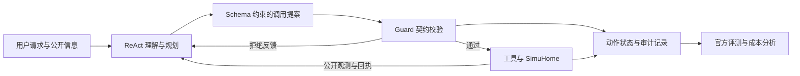

# SmartHome Agent 项目总结书

截至 2026-10-06；总结依据：工程交付版本 `82d2f76`，最终链路验收冻结版本 `5f407b6`；全量benchmark冻结版本 `d875f55`。

## 1. 项目定位与完成情况

本项目基于官方 SimuHome 单轮 benchmark，将原始 ReAct Agent 接入 Agent Lightning，构建可复现、可审计的智能家居 Agent harness。重点解决工具调用契约、动作状态、证据追溯、实验隔离及效果与成本评测问题。

当前计划已收尾至 N37，并已开始实施1006改进计划的N38-N40接口节点。默认方案为 **Qwen3.5-9B + Guard（G）**，动作生命周期记录已接入。工程复现与全量验收目标完成；非法执行明显减少，独立留出评测中的SR显著提升未证实；全量已暴露快照的配对结果为正。N38-N40的接口和离线测试不等于在线效果收益。

项目可以展示 Agent 架构与实验工程能力。当前范围是模拟环境中的官方单轮任务；真实设备接入、多用户服务和生产可靠性未验收。

1006计划的当前状态：N38完成设备契约抽象；N39完成语义验证、自反思解析、置信度门控和公开hard-negative构造；N40完成固定verifier的process reward与RL-A/B/C适配接口。本轮按用户确认只做 Harness 与消融，在线Self-Reflection、小模型训练和GRPO均不执行，接口测试不计作效果收益。

## 2. 系统架构与核心设计



设计原则是分清四类责任：模型提出计划，执行器校验调用，模拟器维护权威状态，评测器判定任务结果。官方隐藏目标与评测结果不进入模型上下文。

| 模块 | 核心设计 | 交付状态 |
|---|---|---|
| 意图理解与规划 | 沿用上游 ReAct，根据请求、工具结构与公开观测逐步规划；不把任务类别作为意图输入 | 默认使用；显式 TaskSpec 目标提取已实现但未采用 |
| 工具契约 | 生成端使用 JSON schema；执行前检查参数、能力、只读属性和部分公开前置条件，拒绝后返回修正依据 | Guard 默认使用；未覆盖契约保留 `uncovered`，不声称完整安全保障 |
| 记忆与上下文 | episode 内账本分开记录公开事实、回执与错误，保留来源和旧版本；动态事实按变更 epoch 标记过期，静态知识独立检索 | 账本及两种上下文管理方案已实现，未采用；不是跨会话用户记忆 |
| 动作状态管理 | 记录动作 ID、完整参数、尝试、父提案、观测版本与回执来源；区分接受、注册、完成、失败和未知 | N31 已接入 G；状态仅在 episode 内维护，无持久崩溃恢复 |
| 异常与恢复 | 分开统计解析拒绝、领域失败、未知结果和基础设施故障；可选 GR 按完整参数与证据控制恢复预算 | GR 工程完成、默认关闭；网络重试仍沿用上游 provider/SDK |
| 调度与观测 | 四个独立 actor、64 个模拟器槽，隔离 GPU、端口与输出；记录请求、tokens、耗时、队列与资源压力 | 已用于配对实验；judge 部署在独立 A800 节点 |
| 审阅与复核 | 只读导出动作时间线、回执与官方结果；按冻结 SHA 核对来源、配置及成本 | N35/N36 已交付；无来源清单时只提供自身哈希 |

状态设计的关键是：`acknowledged` 只表示请求被接受，`registered` 只表示未来工作流已注册，`completed` 也不自动代表用户目标成功。变更请求缺少充分回执时保留 `unknown`，避免把不确定结果写成成功。

详细实现与源码入口见[项目架构](项目架构.md)。

## 3. 实验结果与证据边界

N37完整benchmark：当前官方快照600任务，十二类各50，B0/G×seed42共1,200次。

| 指标 | B0：原9B ReAct | G：原9B + Guard |
|---|---:|---:|
| 成功 / SR | 197/600，32.83% | 231/600，38.50% |
| 非法执行总次数 | 325 | 70 |
| Actor tokens / 任务 | 43,469.2 | 45,853.9 |
| 额外查询总次数 | 0 | 903 |
| 未完成（计失败） | 5 | 8 |

全量SR差+5.67个百分点，95% CI[+2.17,+9.00]、p=0.00245；非法执行减少78.46%，actor tokens/任务增加5.49%。包含历史开发暴露任务，属于全量快照复现，不是600任务的独立留出泛化结论。QT4-2不可行仍0/50，QT4-3依旧薄弱；十二类详情见[实验报表](实验报表.md)。

独立留出证据单独保留：N13采用冻结的新留出集，192个官方任务，十二类各16个，预声明seed42。B0为原ReAct基线，G为增加Guard的方案。

| 指标 | B0：原 9B | G：原 9B + Guard | 含义 |
|---|---:|---:|---|
| 成功任务 / SR | 60/192，31.25% | 69/192，35.94% | 任务整体完成能力；未完成计失败 |
| 非法执行总次数 | 96 | 16 | 实际工具执行返回非法动作错误；不含 schema 拒绝 |
| Actor tokens / 任务 | 41,015.4 | 43,730.1 | 包含成功与失败任务的输入、输出成本，不含 judge |
| Harness 额外查询 | 0 | 295 | 为调用校验增加的公开查询总量 |

G 的 SR 增加 **4.69 个百分点**，95% CI 为 **[-1.04, +10.94]** 个百分点，Holm p=0.216，未达到显著性要求。非法执行减少 **83.33%**，actor tokens 增加 **6.62%**。结果说明调用约束更有效，但合法执行仍可能选错设备、遗漏目标或制定错误时间计划。

seed43/44 的 B0 成功数为 57/58，G 为 69/66；重复种子仅用于预声明可靠性诊断，不能替代 seed42 主检验。旧 Full 在 seed42 成功 71/192，也未达到显著提升要求；项目保留开发阶段选定的 G，没有根据留出结果改选策略。

论文 Qwen3-32B 总体平均为 36.33%，仅作参照。论文使用 600 个任务，本项目任务快照、模型及 judge 不同，不能据数值接近宣称完成同口径论文复现或超过论文。QT1 和不可行任务采用 Qwen3.6-35B-A3B judge，同一模型三票并非三个独立 judge。

完整口径及历史结果见[实验报表](实验报表.md)，正式证据见[N13](nodes/N13.md)。

## 4. 消融结果与取舍

下表均为各自同轮的开发诊断，分母含义不同，不合并为正式收益。

| 尝试 | 核心结果 | 决策 |
|---|---|---|
| 局部 Verify v2 | G/GV2 成功 136/360 → 127/360 | 未采用，额外验证没有带来任务收益 |
| Context v2 | G/GC2 成功 136/360 → 116/360，tokens +3.30% | 未采用，账本替换历史没有实现成本收益 |
| 历史一次 LoRA SFT | 原模型/SFT 成功 51/144 → 24/144，非法执行 31 → 125 | 否决该配置；保留证据，当前不追加训练 |
| 已观察 ID 提示 | 原 9B 成功 26/72 → 26/72，tokens +3.01% | 未采用，减少部分未知设备引用未转化为 SR |
| On/Start 语义提示 | 成功 25/84 → 27/84，非法执行 13 → 35 | 未过安全门槛，不扩大验证 |
| TaskSpec 目标关联 | 成功 23/84 → 7/84，tokens +25.18%；出现长度上限与 JSON 失败 | 未采用，字段关联率不能证明语义正确 |
| 无损公开查询引用 | 96 条 G 轨迹、654 次请求，输入 tokens 节省 0% | 离线停止，没有满足引用规则的真实查询 |

这些结果支持保留较简单的默认方案。增加模块、缩短输出或降低训练 loss，都需要通过任务效果、安全与成本的配对验收，不能直接作为收益。

## 5. 真实案例与问题定位

| 案例 | 观测到的行为 | 暴露的问题 |
|---|---|---|
| N28，seed42，可行任务80 | 补充 On → Heavy → Start → 注册 Pause 后，由失败转成功 | 通电与周期启动是不同动作，公开命令语义影响规划 |
| N28，seed42，可行任务36 | 补 Start 后，错误暂停时间注册返回400，仍重复13次直到20步耗尽 | 局部语义修复没有解决时间推理和失败恢复；该增强最终未采用 |
| N25，任务16 | SFT 将 `study_room` 写成 `study`，查询失败后声称设备不存在 | 实体发现不足、错误归因与提前结束；格式正确不保证任务正确 |

工程审阅保留原官方失败，同时展示动作状态和证据，避免把“调用被接受”或“工作流注册成功”包装成任务完成。历史与最终案例索引见[delivery.json](data/delivery.json)。

## 6. 并发与成本工程

部署采用 **4×H100，各一个 9B actor，每 actor 16 个独立模拟器槽，总计64槽**；Qwen3.6-35B-A3B judge 常驻 2×A800，静态知识使用 CPU BGE 检索。配对任务固定物理 actor，防止资源与路由差异混入策略比较。

N14 同一容量子集每档144次：64槽用时241.84秒、35.73次/分钟；128槽用时289.85秒、29.81次/分钟。该次试跑选择64槽，不能据单次结果断言128槽普遍更慢。更早的 N8 完整性能验收完成1,368次运行，含启动与核验共43分50秒，达到预设一小时门槛；这是旧任务集性能复跑，不替代正式效果结果。

成本分析分开记录 actor、judge、启动、评测与清理，保留失败轮次。官方工作流评测存在长尾，actor HTTP 耗时也包含网络与排队；不能把整条 episode 延迟当成纯模型推理时间，或直接作为生产用户延迟。

N36 最终链路验收24次、453个阶段文件核验通过，全流程400.53秒，其中启动156.87秒。它仅验证最终入口与配置：G 成功5/12、B0成功3/12，但G非法执行5次、B0为3次，G的token成本也更高；小样本不改变N13结论。A800共享资源和部分整理CPU成本未完整分摊。

N37全量1,200次的评测流程含启动与清理共1,320.23秒（约22分钟），启动298.74秒。B0/G的Agent P50/P95为16.00/60.02秒、17.51/63.02秒；包含失败的actor tokens/成功下降10.04%。G任务成功更多，但Agent延迟与每任务tokens增加，不宣称推理加速或生产SLO。12,391文件及全部请求身份核验通过，成本与证据见[全量索引](data/full-benchmark.json)。

## 7. 工程交付与复现

- Git 功能分支及节点独立提交；记录冻结版本、任务清单、生成参数、准入门槛与排除规则。
- 源码、配置、测试及文档分目录；`runs/`、`outputs/`、`work/` 不入 Git，保留原始失败和唯一证据。
- 沿用既有 Conda/venv 环境，交付核对 SimuHome、Lightning 版本及用户补丁身份。
- N35 全量150项测试149通过、1环境跳过；96条G轨迹、705个动作记录核验通过。GitHub CI 已配置，远端执行状态未核验。
- N36/N37模型参数、配对身份、回执与资源释放核验通过；四H100已释放，A800 judge保留常驻。N37纳入此前封存95任务，原始运行及失败证据保留。

离线核心检查：

```bash
python scripts/check_project.py
```

服务器沿用既有环境的链路复现入口：

```bash
source ../activate-agent-lightning.sh
cd /HOME/nsccgz_ywang/nsccgz_ywang_wzh/HDD_POOL/zhengrj/agent/smarthome_agent_rl
python scripts/run_node_experiment.py --config configs/harness-release.json --run-dir runs/delivery/<新目录>
```

命令应在服务器项目根目录执行。该配置只运行已暴露 calibration12 的 B0/G 配对验收，不是重新运行正式留出实验。工作目录与环境说明见[README](../README.md)，节点状态见[PLAN](../PLAN.md)。

## 8. 项目价值与边界

适合对外介绍为：**基于 SimuHome 与 Agent Lightning 的可审计智能家居 Agent harness，通过工具契约约束、动作生命周期记录和四卡配对实验，降低非法执行并验证架构改动的效果与成本。**

项目的工程成果是清楚的责任边界、证据模型、隔离调度和可复现实验决策；效果成果是正式实验中的非法执行降低。全量快照SR提升有配对检验证据，但独立留出显著收益未证实；不能宣称训练有效或已达到生产级。

后续N41–N49增加可选SQLite TaskManager、持久Scheduler、执行分层及冲突检测；N58补齐定时观测窗口与失败证据。这些是工程验收，默认G未替换，尚无官方Scheduler收益或生产可靠性结论。HomeBench17,366条全量结果已完成；N60对称只读诊断显示同格式+Guard时原提示58.02%、加契约54.96%，主要收益来自表示与过滤，契约上下文未改善结果。

N37验收已结束，当前1007节点仍在推进；状态以[计划](../PLAN.md)与[报表](实验报表.md)为准。可靠幂等/事务、权限和生产SLO仍未验收，不追加训练、多轮、新benchmark或生产接入。
