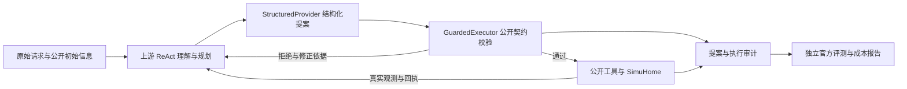
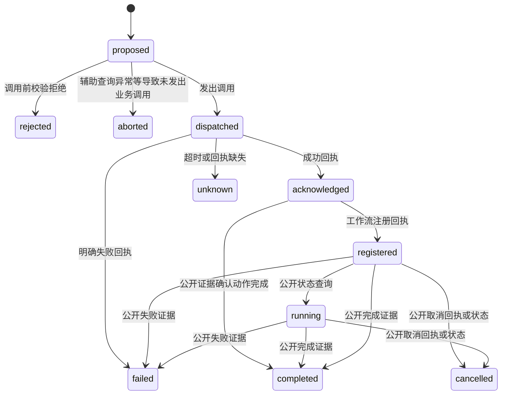

# SmartHome Agent：架构与工程边界

定位：基于官方单轮任务的可审计 Agent harness。模型提出计划，执行器检查公开契约，模拟器维护权威状态，实验系统验证效果与成本。当前采用原 Qwen3.5-9B + G；N31记录动作状态，N32可选恢复预算，N33可选目标关联。

## 当前执行链

官方目标与评测结果不进入模型上下文。Guard 拦截的提案和真正执行的调用分开统计；合法调用仍可能完成错误目标。

| 模块 | 核心设计 | 当前状态与源码 |
|---|---|---|
| 意图理解 | ReAct 理解、规划、选工具；可选TaskSpec保留目标原文、依赖及动作归属 | G保留上游理解；N33的GTS已实现、未准入；[task_spec.py](../smarthome_agent_rl/task_spec.py)。QT类别不作为意图输入 |
| 调用契约 | JSON schema 约束生成，再校验参数、能力、只读属性及部分公开前置条件；未知覆盖记 `uncovered` | G 已使用；[structured.py](../smarthome_agent_rl/structured.py)、[guard.py](../smarthome_agent_rl/guard.py) |
| Executable Contract | 设备侧声明 capability、function、参数类型/范围/enum 和公开状态断言；未知 contract 明确拒绝 | N38 已实现，默认不替换既有 G；[device_contract.py](../smarthome_agent_rl/device_contract.py) |
| 记忆 | episode 内公开观测账本；事实、动作回执、错误分开，保留来源和旧版本，动态观测标过期 | 已实现、未采用；[context.py](../smarthome_agent_rl/context.py)。不是跨会话用户记忆 |
| 上下文 | Context v2用账本替换历史；N34可选GEC仅引用同组完全重复公开查询，保留计划/错误/回执与最近两轮 | 两种方案均未采用；N34对654次G请求输入节省0%，真实引用未触发；[evidence_context.py](../smarthome_agent_rl/evidence_context.py) |
| 状态管理 | episode 内统一动作状态机；辅助查询关联提案，回执引用观测序号，公开工作流查询推进状态 | N31已接入；[action_state.py](../smarthome_agent_rl/action_state.py)。保存JSON快照，尚无持久事件库或崩溃恢复 |
| 异常与恢复 | 校验错误返回结构化反馈；任务失败与基础设施故障分开；可选独立恢复预算 | [benchmark.py](../smarthome_agent_rl/benchmark.py)、[recovery.py](../smarthome_agent_rl/recovery.py)。N32的GR已实现，G默认关闭 |
| 语义验证 | public-only 四维决策；高置信 deny 可阻断，不确定升级 Self-Reflection；Verifier 不读取隐藏评测 | N39 接口已实现，在线对照按本轮范围不执行；[semantic_verifier.py](../smarthome_agent_rl/semantic_verifier.py)、[reflection.py](../smarthome_agent_rl/reflection.py) |
| Process reward / RL | task success 为主，hard/semantic violation 为辅助；verifier 首版冻结，actor/verifier 不同时更新 | N40 接口与 RL-A/B/C 配置已实现，按本轮范围不启动训练；[process_reward.py](../smarthome_agent_rl/process_reward.py)、[agentic_rl.py](../smarthome_agent_rl/agentic_rl.py) |
| 隔离与观测 | 4 actor × 16 模拟器槽；同 task×seed 对照固定 actor，独立端口/输出；外置 judge | 已用于实验；[concurrency.py](../smarthome_agent_rl/concurrency.py)、[profiling.py](../smarthome_agent_rl/profiling.py) |
| 工程审阅 | 只读原轨迹，按冻结SHA核对身份、动作状态、回执归属及成本；原官方结果单独呈现 | N35/N36已交付；[episode_review.py](../smarthome_agent_rl/episode_review.py)、[review_episode.py](../scripts/review_episode.py)；不驱动设备或改写评测 |

G 对工作流默认仅查首个设备的静态能力，不保证未来状态满足前置条件。当前通过进程内替换上游 `run_tool` 接入，依赖 episode 进程隔离；不能直接作为同进程多线程服务。

## 记忆、上下文与状态为什么分开

**记忆保存证据，状态查询决定当前事实，上下文决定本轮模型看到什么。** 账本用规范化的工具名与完整参数作为查询键，保留来源轮次、观测序号、响应及历史差异。成功变更推进 epoch，旧动态事实标 `stale`；时间/工作流查询也会推进 epoch。自然时间推进仍可能让数据过期，这不是强一致缓存。

例如：曾观察到设备 `Stopped`，之后收到 `On` 成功回执，只能确认通电请求被接受；是否运行要看公开运行状态或启动回执。注册未来 `Pause` 成功只能记“已注册”，不能记“已暂停”。模型 thought 不写成设备事实。CPU BGE + FAISS 检索用于静态知识，与动态状态账本分开。

Context v2 的价值假设是减少重复观测，同时保留修正所需证据；实际同轮 G/GC2 成功为 136/360 与 116/360，tokens 增加 3.30%，因此默认关闭。局部效果验证也未采用：G/GV2 为 136/360 与 127/360。详见 [N11](nodes/N11.md)、[N10](nodes/N10.md)。工程设计需要准入证据，不能按模块数量选方案。

## 意图与动作状态

N33实现可选单轮 `TaskSpec`：首次有效响应同时给出工具调用和目标表，不增加解析请求；后续冻结目标，逐轮提出动作归属与设备绑定。代码检查唯一原文引用、子字段原文来源、依赖DAG与成功公开观测中的设备ID，工具与元数据均有效才提交。拓扑变化或目录刷新使缺失设备绑定失效；非法元数据反馈给下一轮，不自动修复或执行。

模型仍可能漏目标、把背景当指令或选错已观测设备；因此提取完整性、语义绑定和目标满足保持`unverified`。依赖只作记录，不自动调度；当前没有目标级finish gate或条件满足判定。详见[N33](nodes/N33.md)。

N33同轮G/GTS成功23/84→7/84、tokens+25.18%，GTS未采用。168次输出触及长度上限且JSON无效；QT3任务45只提取TV目标，却把洗碗机Stop关联TV。高关联率只能证明字段存在。N34从G轨迹验证证据保留规则，输入节省0%而未采用，不把未准入目标表作为可靠记忆。

N31已统一动作记录：`action_id / goal_ids / tool / 完整参数 / attempt / 观测版本 / 状态 / 回执来源`。G的目标关联为空，GTS关联模型给出的目标；辅助查询继承父提案关联，保留独立动作ID。ID仅在episode内唯一；attempt按完整规范参数统计，不等于自动重试。下面是已接入的状态转换，尚未实现未知调用的自动核对恢复：

`acknowledged` 不自动转 `completed`；成功读请求的completed只表示查询完成，工作流completed只表示公开状态报告完成，均不等于用户目标成功。缺少核对证据时维持unknown；未来事件通过已有公开查询更新，不新增轮询。TaskSpec只关联动作证据，不把它转换为目标成功。N31重放192条旧轨迹，返回值、调用顺序与参数一致；详见[N31](nodes/N31.md)。

## 异常与重试：先控制副作用

旧`failures`计数键未包含完整参数，且恢复上限只在`verify=True`时执行；G仍关闭恢复策略，不能把`repair_limit=2`描述为全局保障。N32新增可选GR：按完整参数、错误指纹和相关公开证据检查，首次调用加两次修正；跨证据同参数最多6次明确失败。未知变更不直接重放，参数/证据变化可在预算内修正，原异常继续抛出。网络层仍沿用上游provider默认11次尝试及SDK内层重试，尚未统一收口。

| 异常 | 拟议处置 |
|---|---|
| 解析/schema/能力拒绝 | 原业务动作未执行；依据反馈改计划，消耗修正预算 |
| 明确的领域失败 | 记录错误与观测版本；修正参数/前置条件，重复失败达到预算则终止该路径 |
| 短暂读请求故障 | 有界退避，计入请求、时间和总预算；遵守阶段基础设施判定规则 |
| 变更请求超时 | 标 unknown，先核对回执/公开状态；不盲重放 Toggle、Start 或工作流注册 |
| 服务或调度基础设施故障 | 按冻结协议判阶段无效，保留全部失败与成本 |

重试是再次调用，重规划是修改目标实现路径，两者分别计数。重复失败识别应包含动作身份、完整规范参数、错误指纹和相关观测版本；环境改变后不能仅凭旧错误永久拒绝。总步数、逐动作尝试、额外查询、tokens 和等待预算分别约束。当前没有经验证的幂等键或 exactly-once 保证。

**真实案例。** N28 seed42 任务80补充 On→Heavy→Start→注册 Pause 后成功；任务36补 Start 后，错误暂停时间注册返回400，仍重复13次直到20步耗尽。前者说明动作语义的重要性，后者暴露时间计划与恢复预算缺口。该增强非法执行13→35，最终未采用；详见 [N28](nodes/N28.md)。

## 功能节点验收

以下工程节点、N35/N36交付及新增N37全量验收均完成，当前计划收尾：GR/GTS/GEC未获在线准入，默认G保留。仍限官方单轮harness，不追加训练；N37按用户授权纳入此前封存95任务，不据全量结果继续调参。源码实现、策略准入与生产能力分别呈现。

| 顺序 | 交付 | 验收重点 |
|---|---|---|
| 1. 动作生命周期（N31完成） | episode 内统一动作记录、状态转换、证据引用 | 192条轨迹行为一致，116项测试115通过/1环境跳过；无新增模型或网络调用 |
| 2. 独立恢复策略（N32工程完成） | 解耦Verify，局部与episode预算、未知变更保护；网络重试保持原样 | 124测试123通过/1跳过，192条离线审计。标记潜在循环不等于在线收益；详见[N32](nodes/N32.md) |
| 3. 单轮目标关联（N33完成，未采用） | TaskSpec、目标—动作关联、公开实体绑定 | 137测试136通过/1跳过、192条在线轨迹核验；SR、安全、成本与提取门槛失败，9例语义审阅未通过 |
| 4. 证据驱动上下文（N34完成，未采用） | 不依赖GTS目标表；公开重复查询引用、原文还原及变更epoch隔离 | 96条G轨迹654请求、tokenizer与HTTP usage一致；输入节省0%，零真实引用，离线门槛失败；详见[N34](nodes/N34.md) |
| 5. 工程审阅与检查（N35完成） | 只读来源/状态/回执/成本核对，核心CI及现有venv全量检查 | 96轨迹/705动作核验；150测试149通过/1跳过；详见[N35](nodes/N35.md) |
| 6. 最终交付（N36完成） | 默认G配置，四卡链路验收与可追溯案例、归档、清理 | 24次/453阶段文件核验，12份当前案例，GPU释放、judge保留；仅链路诊断，详见[N36](nodes/N36.md) |
| 7. 全量验收（N37完成） | 冻结B0/G的官方600任务、四卡64槽 | 1,200次/12,391文件核验，SR32.83%→38.50%，非法325→70；全量含已暴露任务，独立留出结论保留；[N37](nodes/N37.md) |

行为增强须提前冻结任务、参数、目标错误和收益/成本/安全门槛，四卡64槽做配对。离线通过只证明逻辑；已暴露任务上的结果不作为独立留出泛化收益。N95–N99的运行时工程验收入口为 `scripts/runtime_acceptance.py`，不启动模型或模拟器；日志包含 actor/judge 请求、失败、usage 和阶段耗时；HTTP 延迟包含网络与排队，不能作为纯 GPU 推理时间。

默认G仍沿用上述单轮链路。N41–N49提供可选执行分层、SQLite TaskManager、Scheduler与只报告的冲突检测；N58要求可信定时观测。N61统一入口保留两套原生协议/评分，N62的GTM可选连接真实ReAct与原生时间推进：Guard通过→落盘登记意图→原生调度一次→公开时钟监督→工作流/设备读回→更新持久Job。监督共用40次查询预算；超时不重登，漏窗保留UNKNOWN。Agent所选动作意图与用户目标分开，目标条件未核实的Task保留WAITING，Job成功不自动完成Task。原评测器分数独立保留；工程通过不表示SR提升或生产持久服务已验收。

HomeBench格式消融与对称归因见[实验报表](实验报表.md)、[N60](nodes/N60.md)。跨会话、持久触发、本轮新增训练均未开展；崩溃后自动恢复服务、可靠幂等、权限和生产SLO仍未验收。

N65–N66的独立GTME改用公开工具/原生时间推进响应触发监督，到点才在共享预算内读原生状态、设备及最终时钟；重复事件合并，窗口内UNKNOWN凭新证据确认，不重放动作。720回合原生验收确认191个Job中的64个DONE；Task仍WAITING，SR收益不稳定，默认G保留。详见[N66](nodes/N66.md)。

N68可选GTMEC从公开结构与实际调度参数登记固定目标，按同设备/属性及重叠验证窗口报告冲突；未知后续效果清除旧声明，不推断未来状态或持续占用。Job登记后，下一次Agent请求收到有界摘要与未覆盖/截断标记；不会自动取消或仲裁。原生工程测试通过，官方收益待验；[N68](nodes/N68.md)。N67独立用户目标解析未准入，不能将这些动作声明当作用户目标。
