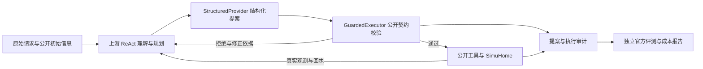
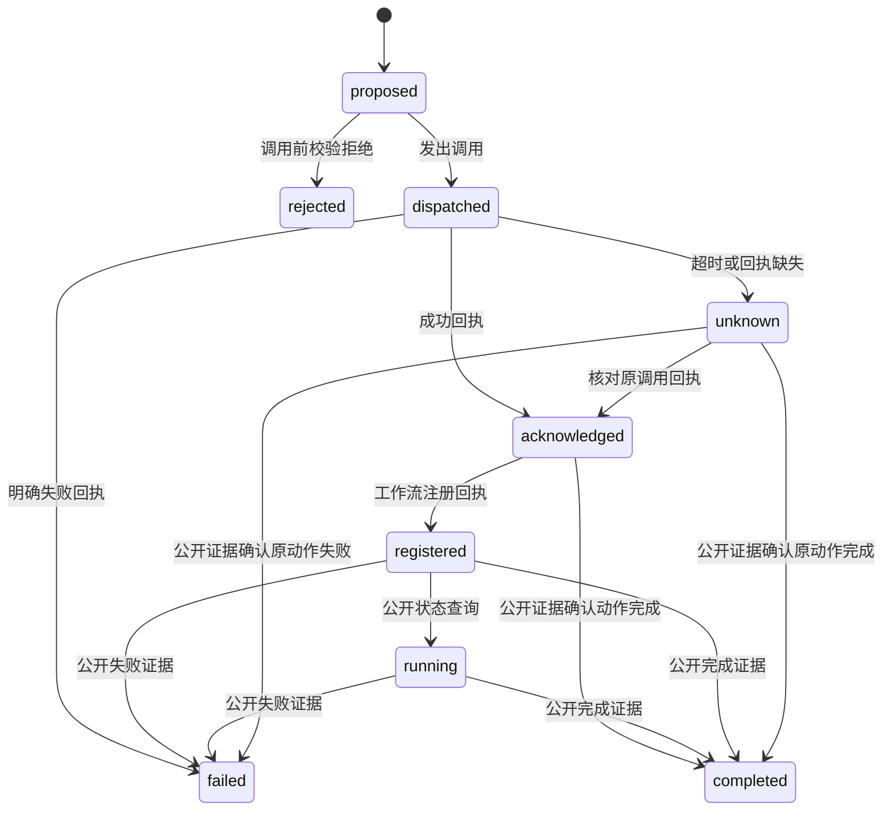

# SmartHome Agent：架构与工程边界

定位：基于官方单轮任务的可审计 Agent harness。模型提出计划，执行器检查公开契约，模拟器维护权威状态，实验系统验证效果与成本。当前采用原 Qwen3.5-9B + G；本页以 `59620b5` 代码为核对基点，拟议设计单独标明。

## 当前执行链

官方目标与评测结果不进入模型上下文。Guard 拦截的提案和真正执行的调用分开统计；合法调用仍可能完成错误目标。

| 模块 | 核心设计 | 当前状态与源码 |
|---|---|---|
| 意图理解 | 上游 ReAct 联合理解、规划、选工具；任务类别 QT1–QT4 是评测标签 | 已使用；[harness_agent.py](../smarthome_agent_rl/harness_agent.py)。没有独立意图分类器 |
| 调用契约 | JSON schema 约束生成，再校验参数、能力、只读属性及部分公开前置条件；未知覆盖记 `uncovered` | G 已使用；[structured.py](../smarthome_agent_rl/structured.py)、[guard.py](../smarthome_agent_rl/guard.py) |
| 记忆 | episode 内公开观测账本；事实、动作回执、错误分开，保留来源和旧版本，动态观测标过期 | 已实现、未采用；[context.py](../smarthome_agent_rl/context.py)。不是跨会话用户记忆 |
| 上下文 | 保留原任务、system/few-shot、最近两对完整交互；历史换为账本，仅更省时替换 | Context v2 已实现、未采用；真实 tokenizer 复核成本，完整版本留审计文件 |
| 状态管理 | 提案、实际观测、工作流注册回执分别记录；模拟器管设备状态，Lightning 管 rollout 生命周期 | 已记录但尚无统一动作状态机、持久事件库或崩溃恢复 |
| 异常与恢复 | 校验错误返回结构化反馈；任务失败与基础设施故障分开归类 | 已部分实现；[benchmark.py](../smarthome_agent_rl/benchmark.py)。G 没有通用的逐动作重试上限 |
| 隔离与观测 | 4 actor × 16 模拟器槽；同 task×seed 对照固定 actor，独立端口/输出；外置 judge | 已用于实验；[concurrency.py](../smarthome_agent_rl/concurrency.py)、[profiling.py](../smarthome_agent_rl/profiling.py) |

G 对工作流默认仅查首个设备的静态能力，不保证未来状态满足前置条件。当前通过进程内替换上游 `run_tool` 接入，依赖 episode 进程隔离；不能直接作为同进程多线程服务。

## 记忆、上下文与状态为什么分开

**记忆保存证据，状态查询决定当前事实，上下文决定本轮模型看到什么。** 账本用规范化的工具名与完整参数作为查询键，保留来源轮次、观测序号、响应及历史差异。成功变更推进 epoch，旧动态事实标 `stale`；时间/工作流查询也会推进 epoch。自然时间推进仍可能让数据过期，这不是强一致缓存。

例如：曾观察到设备 `Stopped`，之后收到 `On` 成功回执，只能确认通电请求被接受；是否运行要看公开运行状态或启动回执。注册未来 `Pause` 成功只能记“已注册”，不能记“已暂停”。模型 thought 不写成设备事实。CPU BGE + FAISS 检索用于静态知识，与动态状态账本分开。

Context v2 的价值假设是减少重复观测，同时保留修正所需证据；实际同轮 G/GC2 成功为 136/360 与 116/360，tokens 增加 3.30%，因此默认关闭。局部效果验证也未采用：G/GV2 为 136/360 与 127/360。详见 [N11](nodes/N11.md)、[N10](nodes/N10.md)。工程设计需要准入证据，不能按模块数量选方案。

## 意图与动作状态：后续设计

拟议增加单轮 `TaskSpec`：每个目标记录 `goal_id`、原文位置、目标设备描述、期望条件、时间约束、依赖和解析状态。实体 ID 仅绑定公开查询结果；歧义或未覆盖语义保持 unresolved。模型负责提议，确定性逻辑检查引用与覆盖，不读取隐藏 evaluator 条件。先验证多目标遗漏、时间依赖和错误绑定，独立分类器并非必需。

拟议统一动作记录：`action_id / goal_id / tool / 完整参数 / attempt / 观测版本 / 状态 / 回执来源`。下面是待实现的逻辑状态机：

`acknowledged` 不自动转 `completed`；缺少公开核对接口时维持 `unknown`。动作完成也不等于整个用户目标成功，目标层另记未满足/已满足/未知及证据。未来事件需后续公开查询才更新状态，不用当前状态预测未来成功。

## 异常与重试：先控制副作用

当前 `failures` 计数键未包含完整参数，且恢复上限只在 `verify=True` 时执行；G 的 `verify=False`，不能把配置中的 `repair_limit=2` 描述为全局保障。SDK 网络重试行为也尚未统一核查。后续恢复策略应独立于 Verify：

| 异常 | 拟议处置 |
|---|---|
| 解析/schema/能力拒绝 | 原业务动作未执行；依据反馈改计划，消耗修正预算 |
| 明确的领域失败 | 记录错误与观测版本；修正参数/前置条件，重复失败达到预算则终止该路径 |
| 短暂读请求故障 | 有界退避，计入请求、时间和总预算；遵守阶段基础设施判定规则 |
| 变更请求超时 | 标 unknown，先核对回执/公开状态；不盲重放 Toggle、Start 或工作流注册 |
| 服务或调度基础设施故障 | 按冻结协议判阶段无效，保留全部失败与成本 |

重试是再次调用，重规划是修改目标实现路径，两者分别计数。重复失败识别应包含动作身份、完整规范参数、错误指纹和相关观测版本；环境改变后不能仅凭旧错误永久拒绝。总步数、逐动作尝试、额外查询、tokens 和等待预算分别约束。当前没有经验证的幂等键或 exactly-once 保证。

**真实案例。** N28 seed42 任务80补充 On→Heavy→Start→注册 Pause 后成功；任务36补 Start 后，错误暂停时间注册返回400，仍重复13次直到20步耗尽。前者说明动作语义的重要性，后者暴露时间计划与恢复预算缺口。该增强非法执行13→35，最终未采用；详见 [N28](nodes/N28.md)。

## 后续功能节点与验收

以下是工程方向，尚未开发或启动实验；仍限官方单轮 harness，不追加训练，不启封95个任务。每次仅改一个机制，先使用已有公开轨迹重放，再按冻结协议进行同轮 G 对照。

| 顺序 | 交付 | 验收重点 |
|---|---|---|
| 1. 动作生命周期与错误类型 | episode 内统一动作记录、状态转换、证据引用；替代分散状态推断 | 拒绝不记执行、注册不记完成、超时保留未知；重放输出可复算，无新增隐藏信息 |
| 2. 独立恢复策略 | 核查上游/SDK重试，明确各层预算；解耦 Verify 的失败限额 | 复现任务36的循环；预算生效，未知副作用不盲重放，成本完整。具体阈值运行前冻结 |
| 3. 单轮意图与目标覆盖 | 最小 TaskSpec、目标—动作关联、公开实体绑定 | 原文可追溯，未解析不伪造，区分通电/运行和注册/完成；覆盖标记不冒充官方成功 |
| 4. 证据驱动上下文 | 按目标选事实与错误，显式处理过期；完整轨迹另存 | 关键失败证据不丢失，实测整条轨迹 tokens/延迟，未省成本则不采用 |

行为增强须提前冻结任务、参数、目标错误和收益/成本/安全门槛，四卡64槽做配对。离线通过只证明逻辑；已暴露任务上的在线结果仍是开发诊断。日志包含 actor/judge 请求、失败、usage 和阶段耗时；HTTP 延迟包含网络与排队，不能作为纯 GPU 推理时间。

项目可展示的成果是契约边界、证据模型、隔离调度、故障归类和可复现实验决策。生产服务所需的持久恢复、事务/幂等、权限、多用户隔离与 SLO 目前没有验收证据。当前工程价值与指标见 [实验报表](实验报表.md)，开发记录见 [N30](nodes/N30.md)。
